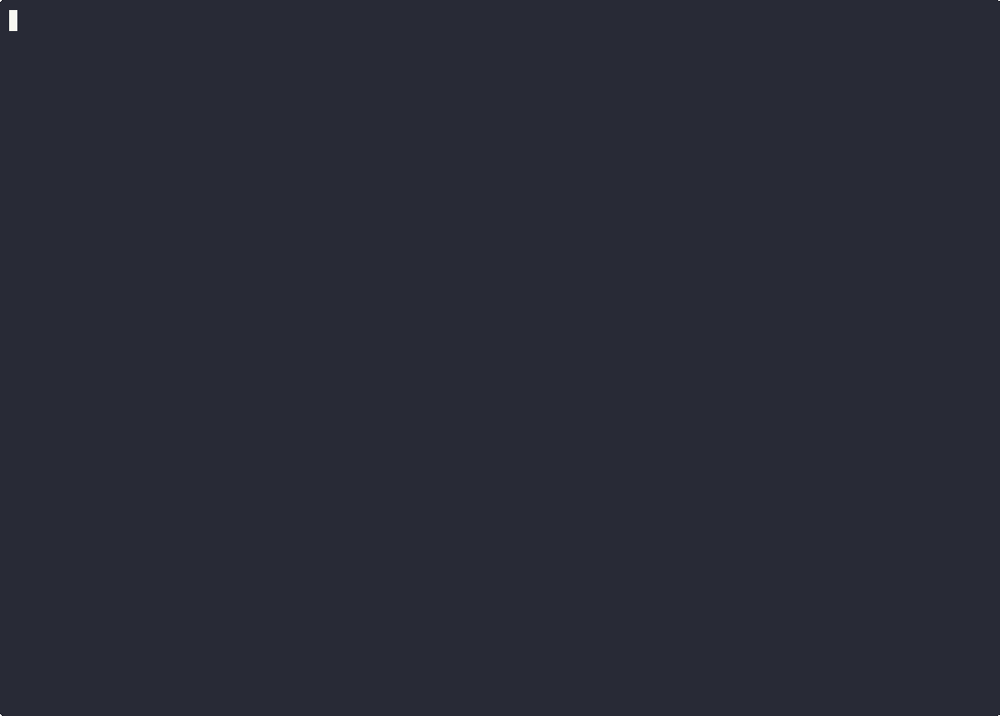

# Agent Memory Bridge

[简体中文](README.zh-CN.md)

[](https://modelcontextprotocol.io)
[](https://glama.ai/mcp/servers/zzhang82/Agent-Memory-Bridge)
[](LICENSE)
[](pyproject.toml)

Two-channel MCP memory for coding agents:
durable knowledge + coordination signals.

MCP-native, currently optimized for Codex-first workflows.

v0.6.1 adds:

- classifier-assisted reflex enrichment with `shadow` / `assist` rollout and rule fallback
- reviewed-sample calibration for classifier-vs-keyword decisions
- benchmarked retrieval with `expected_top1_accuracy = 1.0`
- a fuller signal lifecycle: `claim -> extend -> ack / expire / reclaim`
- `extend_signal_lease` as part of the public MCP surface



Most memory tools put everything into one bucket. Agent Memory Bridge keeps two different kinds of state separate:

- `memory` for durable knowledge worth reusing later
- `signal` for short-lived coordination events such as handoffs, review requests, and workflow state

The bridge then promotes raw session output through a small ladder:

`session -> summary -> learn -> gotcha -> domain-note`

## The Problem

Coding agents lose too much between sessions. Teams either keep rediscovering the same fixes, or they end up storing raw transcripts that are expensive to search and noisy to reuse.

Agent Memory Bridge takes a narrower path:

- MCP-native from day one
- local-first runtime
- SQLite + FTS5 instead of heavier infrastructure
- session capture that turns real coding work into reusable memory

## What Makes It Different

1. It separates durable knowledge from coordination state.
2. It stays small and inspectable instead of hiding behind a larger platform.
3. It gives signals a clean lifecycle: `claim -> extend -> ack / expire / reclaim`.
4. It promotes session output into compact machine-readable memory instead of treating summaries as the final artifact.
5. It can add classifier-assisted enrichment without making the bridge depend on that path to stay useful.

If you want a broader memory platform with SDKs, dashboards, connectors, or hosted-first deployment, projects like OpenMemory or Mem0 are closer to that shape.

For a longer positioning note, see [docs/COMPARISON.md](docs/COMPARISON.md).

## 5-Minute Quickstart

Once the MCP server is registered in Codex, the shortest useful path is:

1. write one durable memory
2. write one coordination signal
3. inspect the namespace
4. claim, extend if needed, and acknowledge the signal

```text
store(
  namespace="project:demo",
  kind="memory",
  content="claim: Use WAL mode for concurrent readers."
)

store(
  namespace="project:demo",
  kind="signal",
  content="release note review ready",
  tags=["handoff:review"],
  ttl_seconds=600
)

stats(namespace="project:demo")
browse(namespace="project:demo", limit=10)

claim_signal(
  namespace="project:demo",
  consumer="reviewer-a",
  lease_seconds=300,
  tags_any=["handoff:review"]
)

extend_signal_lease(
  id="<signal_id>",
  consumer="reviewer-a",
  lease_seconds=300
)

ack_signal(id="<signal_id>", consumer="reviewer-a")
```

That shows the core split:

- `memory` keeps what the agent learned
- `signal` carries what another workflow needs to act on right now

Lease renewal is not reclaim. If a lease is still active, the current claimant can extend it. If it has gone stale, another worker should reclaim it instead.

## Demo

There is now a short terminal demo in the repo:

- GIF: [examples/demo/terminal-demo.gif](examples/demo/terminal-demo.gif)
- source: [examples/demo/README.md](examples/demo/README.md)

## Setup

Requirements:

- Python 3.11+
- Codex with MCP enabled
- SQLite with FTS5 support

### 1. Install

PowerShell:

```powershell
python -m venv .venv
.\.venv\Scripts\Activate.ps1
pip install -e .[dev]
```

macOS / Linux:

```bash
python -m venv .venv
source .venv/bin/activate
pip install -e .[dev]
```

### 2. Create bridge config

Copy [config.example.toml](config.example.toml) to:

```text
$CODEX_HOME/mem-bridge/config.toml
```

The important defaults are:

- `[profile]` controls the neutral runtime shape for namespace, actors, title prefixes, and an optional profile source root
- `[bridge]` controls the live local database
- `[watcher]`, `[reflex]`, and `[service]` control the background pipeline
- `[classifier]` controls the optional enrichment gateway used by reflex

The example config uses `~/.codex/mem-bridge/profile-source` as a neutral local sample path so a fresh install does not inherit a personal profile name.

The classifier is optional:

- `mode = "off"` keeps the current deterministic rule path
- `mode = "shadow"` runs classification and records divergence without changing stored tags
- `mode = "assist"` lets classifier tags enrich reflex output while keyword/rule logic remains the fallback

Recommended setup:

- keep the live SQLite database local on each machine
- keep shared profile or source vaults on NAS or shared storage if needed
- move to a hosted backend later if you want true multi-machine live writes

Important: shared SQLite is fine as a transition or backup path, but it is not a strong multi-writer live backend.

### 3. Register the MCP server in Codex

Add this to `$CODEX_HOME/config.toml`:

```toml
[mcp_servers.agentMemoryBridge]
command = "D:\\path\\to\\agent-memory-bridge\\.venv\\Scripts\\python.exe"
args = ["-m", "agent_mem_bridge"]
cwd = "D:\\path\\to\\agent-memory-bridge"

[mcp_servers.agentMemoryBridge.env]
CODEX_HOME = "%USERPROFILE%\\.codex"
AGENT_MEMORY_BRIDGE_HOME = "%USERPROFILE%\\.codex\\mem-bridge"
AGENT_MEMORY_BRIDGE_CONFIG = "%USERPROFILE%\\.codex\\mem-bridge\\config.toml"
```

### 4. Start the service

Start the MCP server:

```powershell
.\.venv\Scripts\python.exe -m agent_mem_bridge
```

Run the background bridge service:

```powershell
.\.venv\Scripts\python.exe .\scripts\run_mem_bridge_service.py
```

Run one cycle only:

```powershell
$env:AGENT_MEMORY_BRIDGE_RUN_ONCE = "1"
.\.venv\Scripts\python.exe .\scripts\run_mem_bridge_service.py
```

Optional startup install:

```powershell
.\scripts\install_startup_watcher.ps1
```

Optional local Docker image:

```powershell
docker build -t agent-memory-bridge:local .
docker --context desktop-linux run --rm -i agent-memory-bridge:local
```

## MCP Tools

The public MCP surface stays small on purpose:

- `store` and `recall`
- `browse` and `stats`
- `forget` and `promote`
- `claim_signal`, `extend_signal_lease`, and `ack_signal`
- `export`

The complexity stays behind the bridge:

- watcher capture from Codex rollout files
- checkpoint and closeout sync
- reflex promotion
- domain consolidation

## Namespaces

Start simple:

- `global` for a default shared bucket
- `project:<workspace>` for project-local memory
- `domain:<name>` for reusable domain knowledge

The framework is profile-agnostic. A specific operator profile can sit on top, but the bridge itself does not need to look or sound like that profile.

## Trust and Health Checks

The bridge is meant to be inspectable, not magical:

- `browse`, `stats`, `forget`, and `export` let you inspect and correct bridge state without opening SQLite
- signal status is visible and queryable through `pending`, `claimed`, `acked`, and `expired`
- watcher health checks verify that Codex rollout files still parse into usable summaries
- classifier shadow/assist behavior is covered by fixture-based regression tests
- the current test suite passes with `76 passed`

Useful commands:

```powershell
.\.venv\Scripts\python.exe -m pytest
.\.venv\Scripts\python.exe .\scripts\verify_stdio.py
.\.venv\Scripts\python.exe .\scripts\run_healthcheck.py --report-path .\examples\healthcheck-report.json
.\.venv\Scripts\python.exe .\scripts\run_watcher_healthcheck.py --report-path .\examples\watcher-health-report.json
```

## Proof and Benchmark

Retrieval quality is now benchmarked instead of guessed.

The bridge now has a small canonical proof and benchmark harness.

- deterministic proof checks signal correctness, duplicate suppression, and recall timing
- retrieval benchmark tracks `precision@1`, `precision@3`, and `expected_top1_accuracy`
- the retrieval report compares bridge recall against a simple file-scan baseline
- learning-quality upgrades now ship with classifier-vs-fallback regression coverage
- classifier calibration now runs on reviewed samples and reports where the classifier beats or loses to keyword fallback

On the current canonical fixture:

- `memory_expected_top1_accuracy = 1.0`
- `file_scan_expected_top1_accuracy = 0.5`
- `duplicate_suppression_rate = 1.0`

On the current reviewed calibration set:

- `classifier_exact_match_rate = 0.667`
- `fallback_exact_match_rate = 0.0`
- `classifier_better_count = 4`
- `fallback_better_count = 2`

This is not a leaderboard. It is a regression harness that keeps retrieval quality and coordination semantics honest as the bridge evolves.

## More Docs

- [CONTRIBUTING.md](CONTRIBUTING.md)
- [AGENTS.md](AGENTS.md)
- [docs/COMPARISON.md](docs/COMPARISON.md)
- [docs/STARTUP-PROTOCOL.md](docs/STARTUP-PROTOCOL.md)
- [docs/MEMORY-TAXONOMY.md](docs/MEMORY-TAXONOMY.md)
- [docs/PROMOTION-RULES.md](docs/PROMOTION-RULES.md)
- [docs/MODEL-ROUTING.md](docs/MODEL-ROUTING.md)
- [docs/ROADMAP.md](docs/ROADMAP.md)
- [docs/PRODUCTION-STATUS.md](docs/PRODUCTION-STATUS.md)

## License

MIT. See [LICENSE](LICENSE).
