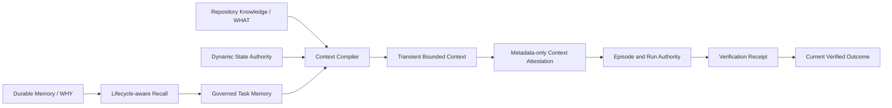

<p align="center">
  
</p>

<h1 align="center">Agent Memory Bridge</h1>

<p align="center"><strong>Your agent stops forgetting why you skipped Redis.</strong></p>

<p align="center">
  Teach one project decision once. Open a fresh Cursor session and get the reason back — without reconstructing it from old chats.
</p>

<p align="center"><a href="README.zh-CN.md">简体中文</a></p>

<p align="center">
  <a href="https://pypi.org/project/agent-memory-bridge/"></a>
  <a href="https://modelcontextprotocol.io"></a>
  <a href="https://github.com/zzhang82/Agent-Memory-Bridge/actions/workflows/ci.yml"></a>
  <a href="https://github.com/zzhang82/Agent-Memory-Bridge/releases"></a>
  <a href="LICENSE"></a>
  <a href="pyproject.toml"></a>
</p>

## Cursor happy path (5 minutes)

Requires **Python 3.11+**, Git, and Cursor. Current source version: `0.32.2`.

### 1. Install

```bash
pip install agent-memory-bridge
```

### 2. Connect Cursor

```bash
python -m agent_mem_bridge setup --client cursor --apply
```

Reload Cursor after apply so it launches AMB as a local MCP stdio server.

### 3. Initialize this project

```bash
python -m agent_mem_bridge project init .
```

Confirm the proposed namespace (for example `project:my-app`). Init derives a repository baseline; it does not invent decisions.

### 4. Teach one decision that matters

In Cursor, tell the connected agent:

> Remember that we decided not to add Redis because this project is intentionally local-first and single-node.

The agent stores that explicit decision and reason through AMB. AMB does not infer durable decisions from code or archive the whole chat.

### 5. Prove it in a fresh Cursor session

Close the chat (or start a new Cursor session on the same project), then ask:

> Why did we skip Redis?

**Done when Cursor answers from memory** — local-first / single-node — without you re-explaining it. That agent recall is the proof. CLI `explore` / `inspect` are optional later for humans; they are not the day-one success check.

---

## After first success

Install once; connect each coding client separately if you need more than Cursor. Clients that should share memory must use the same configured local AMB home. See [Integrations](docs/INTEGRATIONS.md).

Optional local review after the Cursor loop lands:

```bash
python -m agent_mem_bridge explore --namespace project:my-app
python -m agent_mem_bridge inspect --namespace project:my-app --query "Should we add Redis?"
```

<details>
<summary>Virtualenv install, preview-only setup, and troubleshooting</summary>

For a stable launcher shared across clients:

```bash
python -m venv .amb-venv
# Replace <venv-python> with the venv's Python for your OS
<venv-python> -m pip install agent-memory-bridge
# or pin: <venv-python> -m pip install agent-memory-bridge==0.32.2
```

Preview setup without writing config:

```bash
python -m agent_mem_bridge setup --client cursor
```

`setup` is read-only by default. Use `--apply` only after you review the preview. Some clients stay preview/manual when AMB will not guess an unsafe config path — see [Integrations](docs/INTEGRATIONS.md).

Repository WHAT comes from a clean Git commit. If HEAD changes or the worktree is dirty, AMB will not present an old snapshot as current truth. Refresh is explicit:

```bash
python -m agent_mem_bridge bootstrap-repo . --namespace project:<name>
```

Refreshing repository WHAT leaves durable project WHY unchanged.

```bash
python -m agent_mem_bridge doctor
python -m agent_mem_bridge verify
```

`first-run` remains optional guided help; it is not the modern Project Learning entrypoint.

Published releases: [GitHub Releases](https://github.com/zzhang82/Agent-Memory-Bridge/releases). An exact source checkout can still be installed with `pip install -e .` for development or audit work.

</details>

## Your project should not start over with every session

A project is more than its current files. Over time, useful context gets scattered across repositories, chats, coding agents, reviews, fixes, and one-off decisions. A new session can see the code but still miss the reasons, constraints, corrections, and history that make the project make sense.

AMB gives that project context a durable place to accumulate without turning memory into an unreviewable transcript dump.

| Without shared project memory | With AMB |
|---|---|
| Each session reconstructs context | Useful project knowledge carries forward |
| Decisions disappear into old chats | Explicit decisions and reasons stay with the project |
| Different tools build different partial pictures | Supported MCP clients can use the same configured local AMB home |
| Memory can become stale or ambiguous | Provenance, revision, supersession, and inspection keep it governable |

AMB is local-first and inspectable. It does not silently archive every conversation or treat every remembered statement as equal authority.

## One project, memory that grows with it

AMB starts small: derive a reviewable baseline from the repository, then add the decisions, constraints, corrections, and context that are worth carrying forward.

```text
repo / project baseline
        +
explicit decisions and constraints
        +
revisions, corrections, provenance
        ↓
   governed project memory
        ↓
future sessions · coding agents · tools
```

The repository is the common starting point for software projects, but the memory model is about the **project**, not just the codebase: the durable knowledge surrounding the work can outlive any one chat, agent, or tool.

Under the hood, AMB keeps repository-derived facts separate from explicitly taught project knowledge:

**Code tells AMB WHAT the project is.**

**Conversations teach AMB WHY it is that way.**

That distinction is a trust boundary, not the whole product story: derived facts can be rebuilt from current code, while durable project knowledge remains explicit, reviewable, and governed.

## Integrations

AMB works through local stdio MCP. Generic MCP clients are supported; Codex is the reference workflow; Claude Code, Claude Desktop, Cursor, and Cline are documented; and Antigravity, OpenCode, and Hermes have locally tested configuration paths.

Integration labels are deliberately narrow and do not imply client certification. See [Integrations](docs/INTEGRATIONS.md) for current setup instructions and boundaries.

## Why the memory stays trustworthy

The useful part of long-lived project memory is not simply remembering more. It is being able to tell where knowledge came from, whether it is still current, and how it changed.

AMB therefore keeps several boundaries explicit:

| Memory concern | AMB approach |
|---|---|
| Current repository truth | Derived from a clean repository state and refreshed explicitly |
| Human decisions and constraints | Stored explicitly as governed durable memory |
| Changed knowledge | Revised or superseded instead of silently overwritten |
| Why context surfaced | Inspectable through local derived views and evidence paths |
| Cross-session reuse | Shared through the same configured local AMB home |
| Privacy | Local-first; no hosted memory service is required |

This is where the earlier **WHAT / WHY** model belongs: it explains one of the mechanisms that keeps memory trustworthy, rather than defining the entire product.

## What AMB is — and is not

AMB is a governed local project-memory layer for coding agents. It is designed to preserve useful context across sessions and tools while keeping durable knowledge, derived repository facts, provenance, and corrections distinguishable.

It is not a transcript archive, a promise that an agent will remember everything, or a system that silently converts every conversation into durable truth.

## Want the details?

| Read | For |
|---|---|
| [Architecture](docs/ARCHITECTURE.md) | System shape and data flow |
| [Authority model](docs/AUTHORITY-CONTRACT.md) | Durable authority, derived views, correction, and audit rules |
| [Knowledge Explorer](docs/KNOWLEDGE-EXPLORER.md) | Human-first read-only project view |
| [Production Status](docs/PRODUCTION-STATUS.md) | Current implementation facts, evidence, and known limits |
| [Integrations](docs/INTEGRATIONS.md) | Client-specific local MCP setup |
| [Install for Agents](INSTALL_FOR_AGENTS.md) | Full install-to-first-success workflow |
| [Configuration](docs/CONFIGURATION.md) | Complete configuration reference |
| [Examples](examples/README.md) | Sanitized demos and artifacts |

## Technical model

The product story above intentionally postpones implementation vocabulary. Internally, AMB keeps `derived_repository` data separate from governed durable memory so one cannot silently become the other. For maintainers and reviewers, the current authority flow is:


```mermaid
flowchart LR
    A[Durable Memory / WHY] --> C[Lifecycle-aware Recall]
    B[Repository Knowledge / WHAT] --> D[Context Compiler]
    S[Dynamic State Authority] --> D
    C --> E[Governed Task Memory]
    E --> D
    D --> F[Transient Bounded Context]
    F --> G[Metadata-only Context Attestation]
    G --> H[Episode and Run Authority]
    H --> I[Verification Receipt]
    I --> J[Current Verified Outcome]
```

SQLite/WAL rows are durable authority. Repository snapshots, FTS rows, embedding sidecars, compiled context, reports, and Explorer views are derived. Context bodies are rendered in process and are not durably persisted by the compiler.

## Trust and privacy

AMB is local-first. It does not require a hosted memory service. It separates durable memory from coordination Signals and mutable Dynamic State, keeps provenance visible, and rejects raw transcripts, hidden reasoning, and inline artifact bodies from the durable episode path.

Read the [Trust Boundary](docs/TRUST-BOUNDARY.md), [Authority Contract](docs/AUTHORITY-CONTRACT.md), and [Closed-Loop Episode Authority](docs/CLOSED-LOOP-EPISODE.md) for the exact boundaries.

## MCP Tools

AMB exposes **17 public MCP tools**:

- `store`, `recall`, `browse`, and `stats`
- `forget`, `feedback`, `promote`, `annotate`, `revise`, and `export`
- `begin_run`, `record_run_event`, `get_run`, and `complete_run`
- `claim_signal`, `extend_signal_lease`, and `ack_signal`

The public tool surface stays small. Setup, Project Init, Explore, Inspect, context assembly, and review reports remain CLI or internal derived workflows rather than becoming more MCP tools.

The local protocol cache contract is `300000/public` for discovery and `0/private` for the tool list; see [MCP Compatibility](docs/MCP-2026-COMPATIBILITY.md) for details.

## Current maturity

The current source is `0.32.2`, uses schema v12, and retains the frozen 17-tool MCP surface. `project init` is the preferred first-project path. Default Explore is a Human-first view over existing repository-derived context and governed project knowledge. Current evidence and non-claims live in [Production Status](docs/PRODUCTION-STATUS.md); published artifacts live in [GitHub Releases](https://github.com/zzhang82/Agent-Memory-Bridge/releases).

## Contributing

Read [CONTRIBUTING.md](CONTRIBUTING.md) for development and public-surface expectations, and [SECURITY.md](SECURITY.md) for vulnerability reporting.

Licensed under [MIT](LICENSE).
