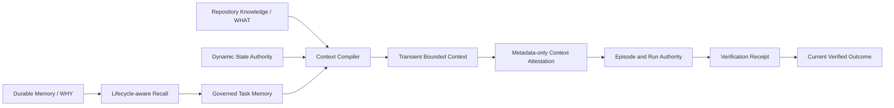

# Agent Memory Bridge

[简体中文](README.zh-CN.md)

[](https://modelcontextprotocol.io)
[](https://github.com/zzhang82/Agent-Memory-Bridge/actions/workflows/ci.yml)
[](https://github.com/zzhang82/Agent-Memory-Bridge/releases)
[](LICENSE)
[](pyproject.toml)

**Agent Memory Bridge (AMB)** is a local-first shared project memory layer for AI coding agents. Code tells AMB what the project is; conversations teach AMB why it is that way. Repository-derived **WHAT** and governed durable project **WHY** remain distinct and are available across tools and sessions through a small local MCP surface.

Current source version: `0.31.0`

Published releases: see [GitHub Releases](https://github.com/zzhang82/Agent-Memory-Bridge/releases)

> AMB complements `AGENTS.md`, `CLAUDE.md`, and client-native preference memory; it does not replace them. It is not a hosted agent runtime, scheduler, queue, or general-purpose memory platform.

## Why AMB

Coding agents often lose useful engineering knowledge between sessions, clients, and handoffs. A plain summary can become stale; opaque retrieval can hide why an item was selected; and mutable operational state should not be mistaken for durable knowledge.

AMB keeps those concerns separate. It stores inspectable engineering memory, applies lifecycle-aware governance before task context is assembled, maintains exact-key mutable state through a distinct authority boundary, and keeps prompt-facing context transient.

## What AMB Provides

| Capability | What it means |
|---|---|
| Durable engineering memory | Local records for decisions, gotchas, procedures, concepts, beliefs, supporting evidence, and coordination signals. |
| Lifecycle-aware retrieval | Eligibility, revision, supersession, validity, relation, and governance boundaries are applied before guidance is used. |
| Dynamic State authority | An internal exact-key release-state lane with version and database-epoch preconditions; it is not semantic memory. |
| Governed task-memory assembly | Task-time selection is derived from the existing governed memory path rather than a second retrieval system. |
| Transient Context Compiler | A bounded, deterministic derived view over repository-derived WHAT, governed task memory, Dynamic State snapshots, and explicit session-local items. |
| Episode and verification evidence | Explicit runs, artifacts, outcomes, and receipts support reviewable evidence without asserting causality or automatic learning. |
| Cross-client MCP access | A stable local stdio interface for supported and documented MCP clients. |
| Repository Knowledge / WHAT | Derived, bounded, rebuildable, namespace-bound repository facts. They are commit-bound only when a clean worktree is proven; stale or unavailable states fail closed, and normal MCP recall exposes only bounded selected WHAT. |
| Durable Project Memory / WHY | Governed durable memory remains in normal recall `items`, retaining memory IDs, receipts, and lifecycle authority; repository facts never become durable memory rows. |
| Knowledge Explorer | A local, read-only, bounded, deterministic, namespace-bound, rebuildable, provenance-bearing projection over existing repository WHAT and governed decision/constraint WHY; it is not a new authority. |

AMB does **not** automatically write lessons back to memory, change ranking from feedback, promote self-generated reflection, or acquire skills autonomously.

## How It Works


```mermaid
flowchart LR
    A[Durable Memory / WHY] --> C[Lifecycle-aware Recall]
    B[Repository Knowledge / WHAT] --> D[Context Compiler]
    S[Dynamic State Authority] --> D
    C --> E[Governed Task Memory]
    E --> D
    D --> F[Transient Bounded Context]
    F --> G[Metadata-only Context Attestation]
    G --> H[Episode and Run Authority]
    H --> I[Verification Receipt]
    I --> J[Current Verified Outcome]
```

Context bodies are rendered in process and are not durably persisted by the compiler. An attestation stores bounded metadata and digests, not the prompt-facing body. A selected context does not prove memory application, and memory application does not prove causality.

Read the complete authority and data-flow story in [Architecture](docs/ARCHITECTURE.md).

## Quick Start

AMB runs locally with **Python 3.11+**, SQLite with FTS5, and an MCP-compatible client that can launch a local stdio server.

```bash
python -m venv .amb-venv
<venv-python> -m pip install -e .
<venv-python> -m agent_mem_bridge setup --client generic
<venv-python> -m agent_mem_bridge bootstrap-repo . --namespace project:my-app
<venv-python> -m agent_mem_bridge first-run --namespace project:my-app --query "What should I check before submitting changes?"
```

Then use the rendered client configuration, reload the client, and run:

```bash
<venv-python> -m agent_mem_bridge doctor
<venv-python> -m agent_mem_bridge verify
```

`setup` owns connection/configuration planning and safe apply; `doctor`/`verify` checks runtime health; `first-run` guides the first useful memory loop; and `inspect` is the daily explanation surface. The current source/package version is `0.31.0`; use a source checkout with `<venv-python> -m pip install -e .` to evaluate this exact checkout. Published release availability and pinned archives are listed in [GitHub Releases](https://github.com/zzhang82/Agent-Memory-Bridge/releases); the source-checkout route above evaluates the current unreleased source. For the detailed workflow, use [Install for Agents](INSTALL_FOR_AGENTS.md), [Installation Notes](llms-install.md), [Integrations](docs/INTEGRATIONS.md), and [Configuration](docs/CONFIGURATION.md).

## Inspect a recall decision

After AMB surfaces task memory, inspect the governed result for a daily, read-only explanation:

```bash
agent-memory-bridge inspect \\
  --namespace project:my-app \\
  --query "What should I check before submitting changes?"
```


Explore the bounded project projection locally:

```bash
agent-memory-bridge explore \\
  --namespace project:my-app
```

The report shows what surfaced, evidence-backed reasons, relevant governed exclusions, and review-required items. It does not list every database record, change durable memory/state/configuration, or prove a surfaced memory was applied or caused an outcome.

## Integrations

AMB is a local stdio MCP server. Generic stdio MCP is supported; Codex is the reference workflow; Claude Code, Claude Desktop, Cursor, and Cline are documented; and Antigravity, OpenCode, and Hermes have locally tested configuration paths. Integration status labels are intentionally narrow and do not imply host certification.

See [Integrations](docs/INTEGRATIONS.md) for client-specific configuration and boundaries.

## Trust and Privacy

SQLite/WAL is the durable local authority. FTS5 and optional local embeddings are derived indexes, not memory authority. Dynamic State is separate from semantic memory. Run artifacts retain bounded metadata only, and AMB rejects raw transcript, hidden-reasoning, and inline artifact-body fields from the durable episode path.

Detailed boundaries are in the [Authority Contract](docs/AUTHORITY-CONTRACT.md), [Trust Boundary](docs/TRUST-BOUNDARY.md), and [Closed-Loop Episode Authority](docs/CLOSED-LOOP-EPISODE.md).

## MCP Tools

AMB exposes **17 public MCP tools**:

- `store`, `recall`, `browse`, and `stats`
- `forget`, `feedback`, `promote`, `annotate`, `revise`, and `export`
- `begin_run`, `record_run_event`, `get_run`, and `complete_run`
- `claim_signal`, `extend_signal_lease`, and `ack_signal`

The public surface is intentionally small. Context assembly, review reports, and other derived views evolve behind these tools rather than adding separate task-packet or context-compiler tools. The local protocol cache contract is `300000/public` for discovery and `0/private` for the tool list; see [MCP Compatibility](docs/MCP-2026-COMPATIBILITY.md) for detail.

## Documentation

| Start here | Use it for |
|---|---|
| [Architecture](docs/ARCHITECTURE.md) | Current high-level system and authority flow. |
| [Production Status](docs/PRODUCTION-STATUS.md) | Current source facts, implemented capability summary, validation evidence, and known boundaries. |
| [Capability History](CHANGELOG.md) | Durable historical capability milestones and retained proof/evidence references. |
| [Install for Agents](INSTALL_FOR_AGENTS.md) | Detailed install-to-first-success workflow. |
| [Integrations](docs/INTEGRATIONS.md) | Client-specific local stdio MCP setup. |
| [Configuration](docs/CONFIGURATION.md) | Complete configuration reference. |
| [Authority Contract](docs/AUTHORITY-CONTRACT.md) | Durable authority, derived views, review, and correction rules. |
| [Trust Boundary](docs/TRUST-BOUNDARY.md) | Local trust, provenance, privacy, and non-goals. |
| [Examples](examples/README.md) | Sanitized examples and demos. |

## Current Maturity

The current source is `0.31.0`, uses schema v12, and retains the frozen 17-tool MCP surface. Knowledge Explorer is implemented as a CLI-only read-only derived projection over existing project knowledge. Checked-in source facts, validation evidence, and non-claims are maintained in [Production Status](docs/PRODUCTION-STATUS.md). For live CI, use [GitHub Actions](https://github.com/zzhang82/Agent-Memory-Bridge/actions) or the CI badge above; for published versions, use [GitHub Releases](https://github.com/zzhang82/Agent-Memory-Bridge/releases) or the release badge above.

## Roadmap

Future direction is capability-based and deliberately conservative. See the [Roadmap](docs/ROADMAP.md); historical announcements remain evidence, not required reading for the current product story.

## Contributing and Security

Read [CONTRIBUTING.md](CONTRIBUTING.md) for development and public-surface expectations, and [SECURITY.md](SECURITY.md) for the local-first security model and vulnerability reporting process.

Licensed under [MIT](LICENSE).
