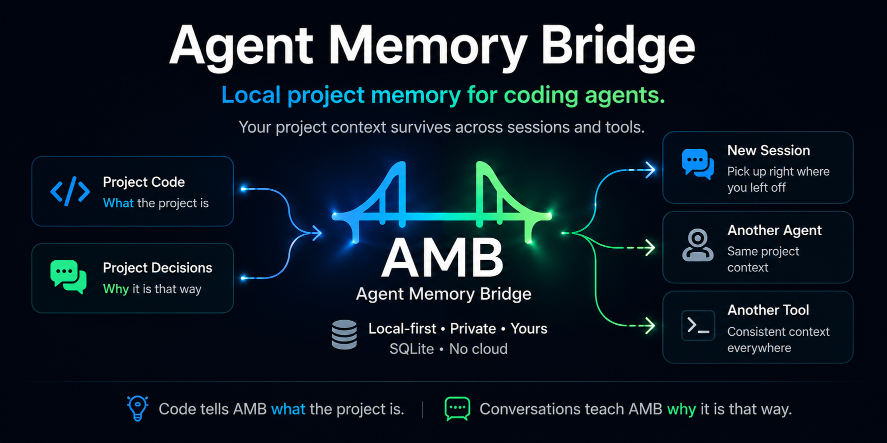
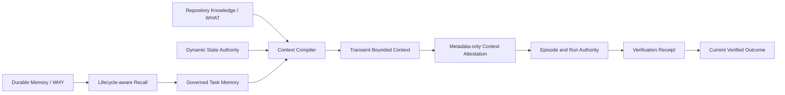

<p align="center">
  
</p>

<h1 align="center">Agent Memory Bridge</h1>

<p align="center"><strong>Local project memory for coding agents.</strong></p>

<p align="center">
  Code tells AMB what the project is.<br />
  You tell AMB why it is that way.
</p>

<p align="center"><a href="README.zh-CN.md">简体中文</a></p>

<p align="center">
  <a href="https://modelcontextprotocol.io"></a>
  <a href="https://github.com/zzhang82/Agent-Memory-Bridge/actions/workflows/ci.yml"></a>
  <a href="https://github.com/zzhang82/Agent-Memory-Bridge/releases"></a>
  <a href="LICENSE"></a>
  <a href="pyproject.toml"></a>
</p>

## When a new session lacks project context

| Common project-memory problem | With AMB |
|---|---|
| Project context must be reconstructed | Repository **WHAT** is derived and inspectable after Project Init |
| Decisions live in old chats or tool-specific memory | Explicit project **WHY** stays with the project |
| Prior reasoning is hard to audit | Inspect explains why relevant context surfaced |
| Knowledge is tied to one client | Supported MCP clients can use the same configured local AMB home |

AMB keeps useful project context outside the chat so a new session, another agent, or another MCP-compatible tool using the same configured AMB home can pick it up. It stays local and inspectable; it does not silently learn from every conversation.

## Quick Start

AMB requires **Python 3.11+**, Git, and an MCP-compatible coding client that can launch a local stdio server.

Current source version: `0.32.0`

Published releases: see [GitHub Releases](https://github.com/zzhang82/Agent-Memory-Bridge/releases)

The live Releases page is the publication authority. To evaluate this exact checkout, install from source; there is no `pip install agent-memory-bridge==0.32.0` route.

### 1. Install and connect AMB

Replace `<venv-python>` with the Python executable inside `.amb-venv` for your operating system.

```bash
python -m venv .amb-venv
<venv-python> -m pip install -e .
<venv-python> -m agent_mem_bridge setup --client generic
```

Use the rendered client configuration, then reload the client.

### 2. Initialize the project

```bash
<venv-python> -m agent_mem_bridge project init .
```

Project Init detects the local Git repository, proposes a namespace such as `project:my-app`, and waits for confirmation. It then derives current repository WHAT and opens the Human-first Explore view. It does not automatically learn decisions.

### 3. Tell your connected coding agent one decision

> Remember that we decided not to add Redis because this project is intentionally local-first and single-node.

The connected agent uses AMB's existing public memory tools to store the explicit decision and reason. AMB does not infer a durable decision from the code or archive the whole conversation.

### 4. Open a new session, then Explore or Inspect

```bash
<venv-python> -m agent_mem_bridge explore \
  --namespace project:my-app

<venv-python> -m agent_mem_bridge inspect \
  --namespace project:my-app \
  --query "Should we add Redis?"
```

Explore answers “What does AMB currently know about this project?” Inspect answers “Why did this information surface for this question?” Both are local and read-only.

This is a conceptual view, not verbatim CLI output:

```text
CODE / WHAT                     CONVERSATION / WHY
────────────────────            ──────────────────────────
Runtime: Python >=3.11          Decision: Do not add Redis
Package: my-app                 Reason: local-first,
Tests: pytest                   single-node project
```

**Code tells AMB WHAT the project is.**

**Conversations teach AMB WHY it is that way.**

<details>
<summary>Refresh and troubleshooting boundaries</summary>

Repository WHAT comes from a clean Git commit. If HEAD changes or the worktree is dirty, AMB will not present an old snapshot as current truth. Refresh is not automatic. Rerun the explicit primitive:

```bash
<venv-python> -m agent_mem_bridge bootstrap-repo . \
  --namespace project:<name>
```

Refreshing repository WHAT leaves durable project WHY unchanged. Explore is CLI-only, not MCP tool #18, and it does not rank context for the model.

`first-run` remains optional guided help; it is not the modern Project Learning entrypoint:

```bash
<venv-python> -m agent_mem_bridge first-run --namespace project:my-app --query "What should I remember?"
```

Use health checks only when setup is uncertain:

```bash
<venv-python> -m agent_mem_bridge doctor
<venv-python> -m agent_mem_bridge verify
```

</details>

## Why AMB?

Repository facts and human decisions are not the same thing.

| CODE / WHAT | CONVERSATION / WHY |
|---|---|
| Derived from the repository | Explicitly taught by a person through a connected agent |
| Rebuildable from current clean code | Durable across sessions and tools using the same configured AMB home |
| Describes the project's current shape | Preserves decisions, constraints, and reasons |
| Refreshed explicitly when code changes | Revised through auditable memory operations |

The public product model stays simple: **CODE / WHAT** and **CONVERSATION / WHY**.

## Integrations

AMB works through local stdio MCP. Generic MCP clients are supported; Codex is the reference workflow; Claude Code, Claude Desktop, Cursor, and Cline are documented; and Antigravity, OpenCode, and Hermes have locally tested configuration paths.

Integration labels are deliberately narrow and do not imply client certification. See [Integrations](docs/INTEGRATIONS.md) for current setup instructions and boundaries.

## Want the details?

| Read | For |
|---|---|
| [Architecture](docs/ARCHITECTURE.md) | System shape and data flow |
| [Authority model](docs/AUTHORITY-CONTRACT.md) | Durable authority, derived views, correction, and audit rules |
| [Knowledge Explorer](docs/KNOWLEDGE-EXPLORER.md) | Human-first read-only project view |
| [Production Status](docs/PRODUCTION-STATUS.md) | Current implementation facts, evidence, and known limits |
| [Integrations](docs/INTEGRATIONS.md) | Client-specific local MCP setup |
| [Install for Agents](INSTALL_FOR_AGENTS.md) | Full install-to-first-success workflow |
| [Configuration](docs/CONFIGURATION.md) | Complete configuration reference |
| [Examples](examples/README.md) | Sanitized demos and artifacts |

## Technical model

The product story above intentionally postpones implementation vocabulary. Internally, AMB keeps `derived_repository` data separate from governed durable memory so one cannot silently become the other. For maintainers and reviewers, the current authority flow is:


```mermaid
flowchart LR
    A[Durable Memory / WHY] --> C[Lifecycle-aware Recall]
    B[Repository Knowledge / WHAT] --> D[Context Compiler]
    S[Dynamic State Authority] --> D
    C --> E[Governed Task Memory]
    E --> D
    D --> F[Transient Bounded Context]
    F --> G[Metadata-only Context Attestation]
    G --> H[Episode and Run Authority]
    H --> I[Verification Receipt]
    I --> J[Current Verified Outcome]
```

SQLite/WAL rows are durable authority. Repository snapshots, FTS rows, embedding sidecars, compiled context, reports, and Explorer views are derived. Context bodies are rendered in process and are not durably persisted by the compiler.

## Trust and privacy

AMB is local-first. It does not require a hosted memory service. It separates durable memory from coordination Signals and mutable Dynamic State, keeps provenance visible, and rejects raw transcripts, hidden reasoning, and inline artifact bodies from the durable episode path.

Read the [Trust Boundary](docs/TRUST-BOUNDARY.md), [Authority Contract](docs/AUTHORITY-CONTRACT.md), and [Closed-Loop Episode Authority](docs/CLOSED-LOOP-EPISODE.md) for the exact boundaries.

## MCP Tools

AMB exposes **17 public MCP tools**:

- `store`, `recall`, `browse`, and `stats`
- `forget`, `feedback`, `promote`, `annotate`, `revise`, and `export`
- `begin_run`, `record_run_event`, `get_run`, and `complete_run`
- `claim_signal`, `extend_signal_lease`, and `ack_signal`

The public tool surface stays small. Setup, Project Init, Explore, Inspect, context assembly, and review reports remain CLI or internal derived workflows rather than becoming more MCP tools.

The local protocol cache contract is `300000/public` for discovery and `0/private` for the tool list; see [MCP Compatibility](docs/MCP-2026-COMPATIBILITY.md) for details.

## Current maturity

The current source is `0.32.0`, uses schema v12, and retains the frozen 17-tool MCP surface. `project init` is the preferred first-project path. Default Explore is a Human-first view over existing WHAT and WHY. Current evidence and non-claims live in [Production Status](docs/PRODUCTION-STATUS.md); published artifacts live in [GitHub Releases](https://github.com/zzhang82/Agent-Memory-Bridge/releases).

## Contributing

Read [CONTRIBUTING.md](CONTRIBUTING.md) for development and public-surface expectations, and [SECURITY.md](SECURITY.md) for vulnerability reporting.

Licensed under [MIT](LICENSE).
