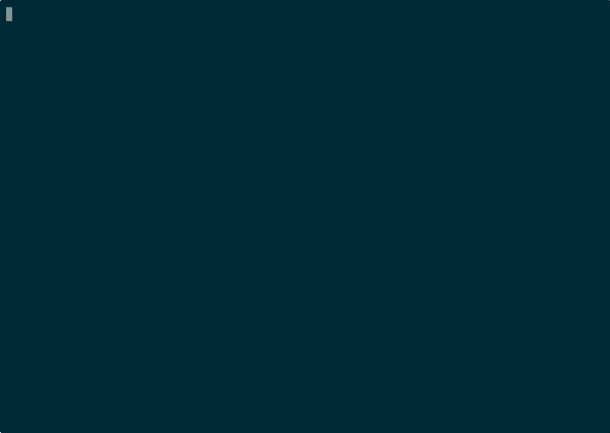

# Agent Memory Bridge

[English](README.md) | 简体中文

[](https://modelcontextprotocol.io)
[](https://glama.ai/mcp/servers/zzhang82/Agent-Memory-Bridge)
[](LICENSE)
[](pyproject.toml)

面向编码代理的双通道 MCP 记忆层：
持久知识 + 协调信号。

MCP-native，目前优先针对 Codex-first 工作流做优化。

`v0.5.0` 这一版新增：

- 可度量的 retrieval，当前 `expected_top1_accuracy = 1.0`
- 更完整的 signal lifecycle：`claim -> extend -> ack / expire / reclaim`
- `extend_signal_lease` 正式进入公开 MCP surface



很多记忆工具会把所有状态塞进一个桶里。Agent Memory Bridge 把两类状态分开：

- `memory`：值得长期复用的持久知识
- `signal`：用于 handoff、轮询和流程协调的短期事件

桥内部沿着一条很小的提升路径工作：

`session -> summary -> learn -> gotcha -> domain-note`

## 它解决什么问题

编码代理跨会话时会丢掉太多状态。团队最后往往落到两种低效路径之一：

- 一直重复发现同样的问题和修复
- 把原始对话当记忆保存，最后变成难检索、难复用的噪音仓库

Agent Memory Bridge 走的是更克制的一条路：

- 从第一天起就是 MCP-native
- 本地优先
- 用 SQLite + FTS5，不先上重型基础设施
- 从真实编码会话里提炼可复用记忆

## 它有什么不同

1. 它把持久知识和协调状态分开。
2. 它默认保持小而可检查，不靠大平台包装。
3. 它给 `signal` 补上了一条更完整的生命周期：`claim -> extend -> ack / expire / reclaim`。
4. 它会把 session 输出提升成紧凑、机器可读的记忆，而不是把 summary 当最终产物。

如果你想要的是更大的记忆平台，带 SDK、dashboard、connectors 或 hosted-first 形态，OpenMemory 和 Mem0 会更接近那条路。

更完整的定位说明见 [docs/COMPARISON.md](docs/COMPARISON.md)。

## 5 分钟上手

在 Codex 里注册好 MCP 以后，最短的有效路径是：

1. 写一条持久记忆
2. 写一条协调信号
3. 看看命名空间里现在有什么
4. claim 那条信号，需要时续租，再 ack

```text
store(
  namespace="project:demo",
  kind="memory",
  content="claim: Use WAL mode for concurrent readers."
)

store(
  namespace="project:demo",
  kind="signal",
  content="release note review ready",
  tags=["handoff:review"],
  ttl_seconds=600
)

stats(namespace="project:demo")
browse(namespace="project:demo", limit=10)

claim_signal(
  namespace="project:demo",
  consumer="reviewer-a",
  lease_seconds=300,
  tags_any=["handoff:review"]
)

extend_signal_lease(
  id="<signal_id>",
  consumer="reviewer-a",
  lease_seconds=300
)

ack_signal(id="<signal_id>", consumer="reviewer-a")
```

这条路径最能体现它的核心拆分：

- `memory` 保存已经学到的东西
- `signal` 传递另一个流程现在需要处理的事

这里要特别说明一点：续租不等于重新领取。lease 还活着时，由当前 claimant 续租；lease 过期后，应该由新的 worker 重新 claim。

## Demo

现在已经有一个很短的 `v0.5` 终端演示：

- GIF: [examples/demo/v0.5-terminal-demo.gif](examples/demo/v0.5-terminal-demo.gif)
- source: [examples/demo/README.md](examples/demo/README.md)

## 安装

要求：

- Python 3.11+
- 启用了 MCP 的 Codex
- 带 FTS5 的 SQLite

### 1. 安装依赖

PowerShell：

```powershell
python -m venv .venv
.\.venv\Scripts\Activate.ps1
pip install -e .[dev]
```

macOS / Linux：

```bash
python -m venv .venv
source .venv/bin/activate
pip install -e .[dev]
```

### 2. 创建 bridge config

把 [config.example.toml](config.example.toml) 复制到：

```text
$CODEX_HOME/mem-bridge/config.toml
```

几个关键默认项：

- `[profile]` 控制默认 namespace、actor、标题前缀，以及可选的 profile source root
- `[bridge]` 控制本地 live 数据库
- `[watcher]`、`[reflex]`、`[service]` 控制后台流水线

示例配置把 `~/.codex/mem-bridge/profile-source` 当作中性的本地 sample path，这样新用户不会一上来就继承带个人色彩的 profile 名称。

推荐做法：

- live SQLite 数据库保留在每台机器本地
- 共享 profile 或 source vault 可以放 NAS 或共享存储
- 真正需要多机实时写入时，再换 hosted backend

要特别注意：

- 共享 SQLite 适合过渡或备份
- 不适合作为强一致、多写入者的最终 live backend

### 3. 在 Codex 里注册 MCP server

把下面内容加到 `$CODEX_HOME/config.toml`：

```toml
[mcp_servers.agentMemoryBridge]
command = "D:\\path\\to\\agent-memory-bridge\\.venv\\Scripts\\python.exe"
args = ["-m", "agent_mem_bridge"]
cwd = "D:\\path\\to\\agent-memory-bridge"

[mcp_servers.agentMemoryBridge.env]
CODEX_HOME = "%USERPROFILE%\\.codex"
AGENT_MEMORY_BRIDGE_HOME = "%USERPROFILE%\\.codex\\mem-bridge"
AGENT_MEMORY_BRIDGE_CONFIG = "%USERPROFILE%\\.codex\\mem-bridge\\config.toml"
```

### 4. 启动服务

启动 MCP server：

```powershell
.\.venv\Scripts\python.exe -m agent_mem_bridge
```

启动后台 bridge service：

```powershell
.\.venv\Scripts\python.exe .\scripts\run_mem_bridge_service.py
```

只跑一轮：

```powershell
$env:AGENT_MEMORY_BRIDGE_RUN_ONCE = "1"
.\.venv\Scripts\python.exe .\scripts\run_mem_bridge_service.py
```

可选：安装开机启动：

```powershell
.\scripts\install_startup_watcher.ps1
```

可选：构建本地 Docker 镜像：

```powershell
docker build -t agent-memory-bridge:local .
docker --context desktop-linux run --rm -i agent-memory-bridge:local
```

## MCP 工具

公开 MCP surface 刻意保持很小：

- `store` 和 `recall`
- `browse` 和 `stats`
- `forget` 和 `promote`
- `claim_signal`、`extend_signal_lease` 和 `ack_signal`
- `export`

真正的复杂度放在桥背后：

- watcher 从 Codex rollout 文件抓取状态
- checkpoint / closeout 同步
- reflex promotion
- domain consolidation

## 命名空间

最自然的起步方式：

- `global`：默认共享 bucket
- `project:<workspace>`：项目级记忆
- `domain:<name>`：可复用的领域知识

这个 framework 本身是 profile-agnostic 的。你可以在上面叠某个 operator profile，但桥本身不需要长成那个 profile 的样子。

## 可检查性与健康检查

这座桥的目标是可检查，不是黑盒：

- `browse`、`stats`、`forget`、`export` 让你不用打开 SQLite 也能看清状态
- `signal` 的状态可以直接查到：`pending`、`claimed`、`acked`、`expired`
- watcher health check 会验证 Codex rollout 文件是否还能被解析成可用 summary
- 当前测试套件结果是 `68 passed`

常用命令：

```powershell
.\.venv\Scripts\python.exe -m pytest
.\.venv\Scripts\python.exe .\scripts\verify_stdio.py
.\.venv\Scripts\python.exe .\scripts\run_healthcheck.py --report-path .\examples\healthcheck-report.json
.\.venv\Scripts\python.exe .\scripts\run_watcher_healthcheck.py --report-path .\examples\watcher-health-report.json
```

## Proof 与 Benchmark

retrieval 质量现在已经是“可 benchmark”，不是“凭感觉猜”。

这座桥现在已经有一套很小但可重复运行的 proof / benchmark harness。

- deterministic proof 会检查 signal correctness、duplicate suppression 和 recall timing
- retrieval benchmark 会跟踪 `precision@1`、`precision@3`、`expected_top1_accuracy`
- retrieval report 会把 bridge recall 和简单 file-scan baseline 放在一起比较

在当前 canonical fixture 上：

- `memory_expected_top1_accuracy = 1.0`
- `file_scan_expected_top1_accuracy = 0.5`
- `duplicate_suppression_rate = 1.0`

这不是排行榜，而是一套回归护栏，用来在 bridge 继续演化时持续盯住 retrieval 质量和 coordination 语义。

## 更多文档

- [CONTRIBUTING.md](CONTRIBUTING.md)
- [AGENTS.md](AGENTS.md)
- [docs/COMPARISON.md](docs/COMPARISON.md)
- [docs/STARTUP-PROTOCOL.md](docs/STARTUP-PROTOCOL.md)
- [docs/MEMORY-TAXONOMY.md](docs/MEMORY-TAXONOMY.md)
- [docs/PROMOTION-RULES.md](docs/PROMOTION-RULES.md)
- [docs/MODEL-ROUTING.md](docs/MODEL-ROUTING.md)
- [docs/ROADMAP.md](docs/ROADMAP.md)
- [docs/PRODUCTION-STATUS.md](docs/PRODUCTION-STATUS.md)

## License

MIT，见 [LICENSE](LICENSE)。
