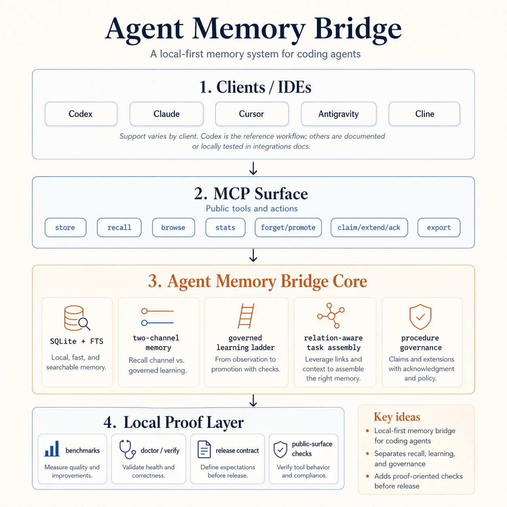

# Agent Memory Bridge

[English](README.md)

[](https://modelcontextprotocol.io)
[](https://glama.ai/mcp/servers/zzhang82/Agent-Memory-Bridge)
[](https://github.com/zzhang82/Agent-Memory-Bridge/actions/workflows/ci.yml)
[](LICENSE)
[](pyproject.toml)

你的 coding agent 不应该每个 session 都重新发现同一批项目决定。

Agent Memory Bridge 是面向 coding agents 的 persistent engineering memory：一个由 SQLite + FTS5 支撑的 local-first MCP memory layer 和 context compiler。它保存可复用的 repo decision、gotcha、procedure 和 handoff，同时把短期协作状态分开处理。

> Codex 是参考工作流，不是产品边界。只要客户端能启动本地 stdio MCP server，就可以使用 Agent Memory Bridge。

<p align="center">
  
</p>

## 为什么存在

很多 agent memory 会落入两个极端：

- summary 变成过时的大块文本
- vector store 能召回，但很难解释为什么召回
- 每个新 session 都要重新学习同一个 gotcha
- handoff 状态变成临时笔记，或者被迫搭一个并不想要的队列

AMB 选择更小的路径：本地 SQLite、显式 namespace、可检查记录、benchmark 过的 recall，以及轻量 signal lifecycle。

## 能带来什么

- Durable memory：决策、gotcha、procedure、concept、belief 和 supporting records。
- Coordination signals：`claim -> extend -> ack / expire / reclaim`，但不假装自己是 scheduler。
- Governed learning：session output 可以沿着 `summary -> learn / gotcha -> domain-note -> belief -> concept-note` 提升。
- Context assembly：startup 和 task-time context 可以从 procedure、concept、belief、gotcha 和 linked support 编译出来，不需要增加更多 MCP tools。
- Proof discipline：release contract、public-surface check、onboarding check、benchmark snapshot，以及 `195 passed`。

## 适合谁

- 你在用 Codex、Claude、Cursor、Cline、Antigravity 或其他 MCP client，并且反复解释同一批项目规则。
- 你想要本地、可检查的 memory，而不是云平台或不透明的 vector stack。
- 你在跑 review、handoff 或 multi-agent workflow，需要轻量 coordination signal，但还不想搭完整 task queue。

## 安装

要求：

- Python 3.11+
- 带 FTS5 的 SQLite
- 任意能启动本地 stdio server 的 MCP-compatible client

```bash
python -m venv .venv
source .venv/bin/activate
python -m pip install -e .
agent-memory-bridge doctor
agent-memory-bridge verify
```

生成 placeholder-safe 的客户端配置：

```bash
agent-memory-bridge config --client generic --example
agent-memory-bridge config --client codex --example
agent-memory-bridge config --client cursor --example
```

如果你想要隔离运行时，也可以用 Dockerized stdio：

```bash
docker build -t agent-memory-bridge:local .
docker run --rm -i \
  -e AGENT_MEMORY_BRIDGE_HOME=/data/agent-memory-bridge \
  -v /path/to/bridge-home:/data/agent-memory-bridge \
  agent-memory-bridge:local
```

客户端配置见 [docs/INTEGRATIONS.md](docs/INTEGRATIONS.md)。运行时配置见 [docs/CONFIGURATION.md](docs/CONFIGURATION.md)。安全说明见 [SECURITY.md](SECURITY.md)。

## 第一个有用闭环

Session 1 发现一条项目规则：

```text
store(
  namespace="project:demo",
  kind="memory",
  content="claim: Use WAL mode for concurrent SQLite readers."
)
```

Session 2 回到同一个项目：

```text
recall(namespace="project:demo", query="SQLite concurrent readers")
```

agent 可以自己拿回那条规则，不需要用户再讲一遍。

协作状态用 signal：

```text
store(namespace="project:demo", kind="signal", content="release note review ready")
claim_signal(namespace="project:demo", consumer="reviewer-a", lease_seconds=300)
extend_signal_lease(id="<signal_id>", consumer="reviewer-a", lease_seconds=300)
ack_signal(id="<signal_id>")
```

终端 demo 在 [examples/demo](examples/demo/README.md)。

## 客户端支持

状态标签刻意保持保守。

| Client | Status | Notes |
|---|---|---|
| Generic stdio MCP | supported | 任意能启动本地 stdio server 的客户端 |
| Codex | verified | 参考工作流，也是最深的 dogfood 路径 |
| Claude Code | documented | CLI 或 project-level stdio MCP config |
| Claude Desktop | documented | 本地 stdio server config；remote/extension flow 是另一层 |
| Cursor | documented | JSON `mcpServers` config |
| Cline | documented | JSON `mcpServers` config |
| Antigravity | locally tested | 在本地 setup 里验证过；UI/config 细节可能变化 |

## MCP Tools

bridge 暴露 `10` public MCP tools：

- `store`, `recall`, `browse`, `stats`
- `forget`, `promote`, `export`
- `claim_signal`, `extend_signal_lease`, `ack_signal`

更复杂的能力留在 surface 后面：reflex promotion、consolidation、startup/task-time assembly、procedure governance、telemetry summaries 和 signal contention checks。当前没有单独的 `task_packet` 或 `startup_packet` MCP tools。

## Proof Snapshot

`0.13.0` 的重点是 coordination under contention，同时保持 public tool surface 稳定。

| Track | Current signal |
|---|---|
| Retrieval | `memory_expected_top1_accuracy = 1.0`, `file_scan_expected_top1_accuracy = 0.636` |
| Calibration | `classifier_exact_match_rate = 0.875`, `fallback_exact_match_rate = 0.062` |
| Procedure governance | `governed_case_pass_rate = 1.0`, `governed_blocked_procedure_leak_rate = 0.0` |
| Signal contention | `signal_contention_case_pass_rate = 1.0`, `duplicate_active_claim_count = 0` |
| Test suite | `195 passed` |

<details>
<summary>Release contract facts</summary>

这些值故意保留在 README 里，让 release check 能发现它们和 benchmark reports 是否漂移。

```text
question_count = 11
memory_expected_top1_accuracy = 1.0
memory_mrr = 1.0
file_scan_expected_top1_accuracy = 0.636
file_scan_mrr = 0.909

sample_count = 16
classifier_exact_match_rate = 0.875
fallback_exact_match_rate = 0.062
classifier_better_count = 13
fallback_better_count = 2
classifier_filtered_low_confidence_count = 2

case_count = 7
flat_case_pass_rate = 0.429
governed_case_pass_rate = 1.0
flat_blocked_procedure_leak_rate = 1.0
governed_blocked_procedure_leak_rate = 0.0
governed_governance_field_completeness = 1.0

signal_contention_case_count = 5
signal_contention_case_pass_rate = 1.0
unique_active_claim_rate = 1.0
duplicate_active_claim_count = 0
active_reclaim_block_rate = 1.0
stale_ack_blocked_rate = 1.0
stale_reclaim_success_rate = 1.0
pending_under_pressure_claim_rate = 1.0
initial_hard_expiry_cap_rate = 1.0
```

</details>

完整 proof 见 [benchmark/README.md](benchmark/README.md)。

## 边界

AMB 不是 graph database、hosted memory platform、scheduler、worker runtime、distributed lock、exactly-once coordination system、packet API，也不会自动从原始 transcript 学出 procedure。它是一个小而可检查的本地 bridge，用来保存可复用工程记忆和轻量协作状态。

替代方案和取舍见 [docs/COMPARISON.md](docs/COMPARISON.md)。

## 文档

- [Client integrations](docs/INTEGRATIONS.md)
- [Configuration](docs/CONFIGURATION.md)
- [Benchmark and proof harness](benchmark/README.md)
- [Context assembly](docs/CONTEXT-ASSEMBLY.md)
- [Memory taxonomy](docs/MEMORY-TAXONOMY.md)
- [Promotion rules](docs/PROMOTION-RULES.md)
- [Client provenance](docs/CLIENT-PROVENANCE.md)
- [Examples](examples/README.md)
- [Contributing](CONTRIBUTING.md)
- [Security](SECURITY.md)

## License

MIT. See [LICENSE](LICENSE).
