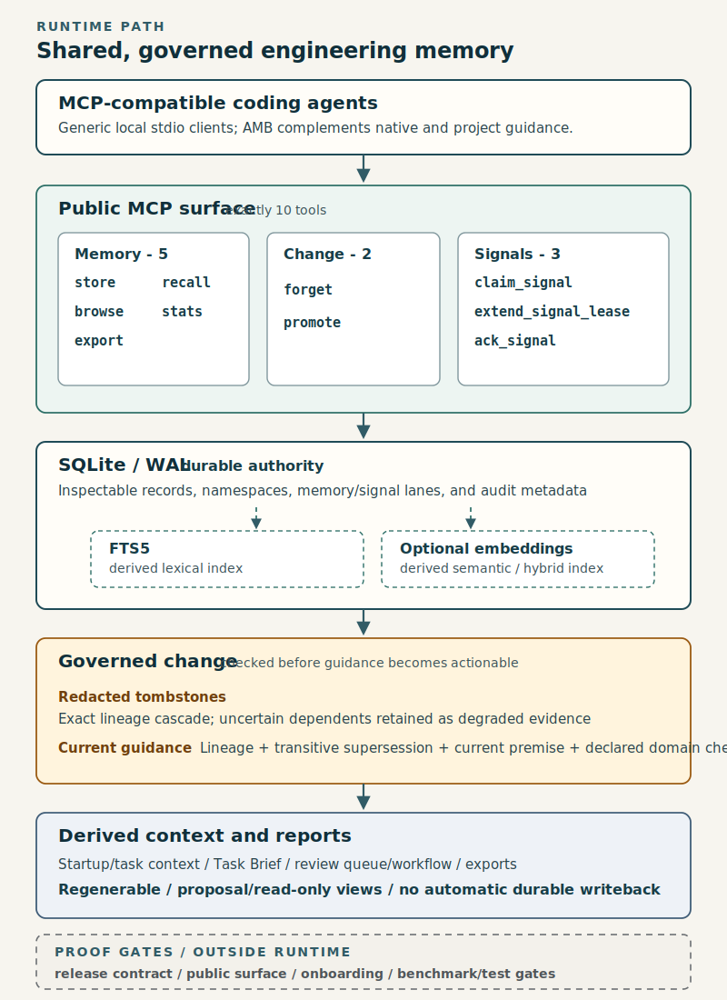

# Agent Memory Bridge

[English](README.md) | 简体中文

[](https://modelcontextprotocol.io)
[](https://glama.ai/mcp/servers/zzhang82/Agent-Memory-Bridge)
[](LICENSE)
[](pyproject.toml)

你的编码代理会在会话之间忘掉自己学过的东西。

Agent Memory Bridge 是一个面向编码代理的本地优先 MCP 记忆服务：把可复用的工程知识和短期协同状态分开存进 SQLite，并通过标准 MCP stdio 暴露出来。

- `memory` 保存值得长期复用的知识
- `signal` 保存 handoff、review、轮询和短期流程状态

会话输出会沿着一条受治理的梯子继续提升：

`session -> summary -> learn / gotcha -> domain-note -> belief -> concept-note`

Codex 是当前最完整的参考客户端，但不是产品边界。只要客户端能启动本地 stdio MCP server，就能接入 Agent Memory Bridge。

<p align="center">
  
</p>


> 30 秒 demo：写入 memory 和 signal，再走一遍 claim -> extend -> ack，随后在同项目里把有用记忆再召回出来。

`0.12.0` 这一版把重点放在“前 5 分钟更容易接入”上：平台中立的安装说明、按客户端分类的配置片段，以及本地 `doctor` / `verify` 检查；同时公开 MCP surface 仍然保持在同样的 `10` 个工具。

## 客户端支持

这里的状态标签刻意写得很保守：

- `verified`：仓库自己长期 dogfood 的路径
- `documented`：这里给出了当前文档对应的配置形状
- `locally tested`：我们本地实际跑过，但还不是主要公开验证路径
- `supported`：依赖通用 stdio 协议约定，而不是某个客户端专属流程

| 客户端 | 状态 | 说明 |
|---|---|---|
| 通用 stdio MCP 客户端 | supported | 任何能启动本地 stdio server 的 MCP 客户端 |
| Codex | verified | 当前最完整的参考工作流 |
| Cursor | documented | JSON `mcpServers` 配置 |
| Cline | documented | JSON `mcpServers` 配置 |
| Claude Code | documented | CLI 或项目级 MCP 配置形状 |
| Claude Desktop | documented | 这里只覆盖本地 stdio server 形状，不覆盖扩展或远程连接 |
| Antigravity | locally tested | 我们本地实际接过，但 UI 和配置入口仍可能变化 |

可直接复制的示例放在 [docs/INTEGRATIONS.md](docs/INTEGRATIONS.md)。

## 它要解决什么问题

编码代理通常会在两个低效路径之间摇摆：

- 每个会话都重新发现同样的问题和修复
- 直接把原始 transcript 当记忆保存，最后得到一个很难检索、很难复用的噪音仓库

Agent Memory Bridge 走的是更克制的一条路：

- 从第一天起就是 MCP-native
- 本地优先
- 用 SQLite + FTS5，而不是先上重基础设施
- 在同一座桥里同时处理可复用记忆和短期协同状态

如果你需要更大的 hosted 平台、仪表盘、连接器或更重的 memory stack，可以看 [docs/COMPARISON.md](docs/COMPARISON.md)。

## 适合谁

- 你在用 Codex、Claude、Cursor、Cline 或别的 MCP 客户端，而且总在重复解释同样的项目决策。
- 你想要本地、可检查的记忆层，而不是云端 memory platform 或不透明的向量堆栈。
- 你在跑 review、handoff 或多代理流程，需要轻量协同状态，但还不想先搭一个任务队列。

## 核心能力

1. 小而稳的公开 MCP surface。桥现在仍然只暴露 `10` 个 public MCP tools，更复杂的行为留在桥内部演进。
2. 双通道记忆和完整的 signal 生命周期。signal 遵循 `claim -> extend -> ack / expire / reclaim`。
3. 受治理的结构化记忆。原始会话输出会被提升成紧凑、机器可读的 artifact，并带着 relation-lite metadata。
4. 可直接用于任务的记忆组装。procedure、concept note、belief 和 supporting records 可以被组装成一次 issue-oriented 本地上下文。
5. 受治理的 procedure memory。`validated` procedure 会被优先使用；`draft` 和 legacy procedure 仍可见但带 warning；`stale`、`replaced`、`unsafe` procedure 会被压出 governed task packet。

## 安装

下面的示例统一使用 POSIX 风格的占位路径，避免把 README 绑死在某个操作系统上。你只需要把这些路径替换成自己机器上的真实路径。

要求：

- Python 3.11+
- 带 FTS5 的 SQLite
- 任意能启动本地 stdio MCP server 的客户端

### 1. 安装包

创建虚拟环境，用你自己的 shell 正常激活它，然后安装：

```bash
python -m venv .venv
source .venv/bin/activate
python -m pip install -e .
```

如果你要跑测试或直接参与这个 repo 的开发，再改用 `.[dev]`。

### 2. 创建 bridge config

把 [config.example.toml](config.example.toml) 复制到你自己控制的本地配置路径，例如：

```text
~/.config/agent-memory-bridge/config.toml
```

最重要的 section 是：

- `[bridge]`：本地数据库和日志
- `[classifier]`：可选的 classifier-assisted enrichment
- `[telemetry]`：metadata-only spans
- `[watcher]` 和 `[service]`：可选的后台自动化
- `[reflex]`：promotion 扫描
- `[profile]`：可选的导入和迁移 helper

更短的配置说明见 [docs/CONFIGURATION.md](docs/CONFIGURATION.md)。

### 3. 生成客户端配置片段

CLI 现在可以直接吐出面向不同客户端的占位安全配置片段：

```bash
agent-memory-bridge config --client generic --example
agent-memory-bridge config --client codex --example
agent-memory-bridge config --client cursor --example
```

通用 stdio 形状如下：

```json
{
  "mcpServers": {
    "agentMemoryBridge": {
      "command": "/path/to/agent-memory-bridge/.venv/bin/python",
      "args": [
        "-m",
        "agent_mem_bridge"
      ],
      "cwd": "/path/to/agent-memory-bridge",
      "env": {
        "AGENT_MEMORY_BRIDGE_HOME": "/path/to/bridge-home",
        "AGENT_MEMORY_BRIDGE_CONFIG": "/path/to/agent-memory-bridge-config.toml",
        "AGENT_MEMORY_BRIDGE_DEFAULT_SOURCE_CLIENT": "generic",
        "AGENT_MEMORY_BRIDGE_DEFAULT_CLIENT_TRANSPORT": "stdio"
      }
    }
  }
}
```

Codex、Cursor、Cline、Claude Desktop、Claude Code、Antigravity 的具体示例都在 [docs/INTEGRATIONS.md](docs/INTEGRATIONS.md)。

### 4. 本地验证

接入真实项目之前，先跑 onboarding checks：

```bash
agent-memory-bridge doctor
agent-memory-bridge verify
```

- `doctor` 会检查 Python、SQLite FTS5、配置解析和 bridge 路径是否可写。
- `verify` 会拉起一个隔离的 stdio server，列出公开工具面，存一条 memory，再跑一遍测试 signal 的 `claim -> extend -> ack`，不会污染你的 live bridge 数据。

## 5 分钟上手

在客户端里注册好 server 之后，最短的有效路径是：

1. 写一条 durable memory
2. 写一条 coordination signal
3. 看看命名空间里现在有什么
4. claim 那条 signal，必要时 extend，然后 ack

```text
store(
  namespace="project:demo",
  kind="memory",
  content="claim: Use WAL mode for concurrent readers."
)

store(
  namespace="project:demo",
  kind="signal",
  content="release note review ready",
  tags=["handoff:review"],
  ttl_seconds=600
)

stats(namespace="project:demo")
browse(namespace="project:demo", limit=10)

claim_signal(
  namespace="project:demo",
  consumer="reviewer-a",
  lease_seconds=300,
  tags_any=["handoff:review"]
)

extend_signal_lease(
  id="<signal_id>",
  consumer="reviewer-a",
  lease_seconds=300
)

ack_signal(id="<signal_id>", consumer="reviewer-a")
```

续租不等于重新认领。lease 还有效时，由当前 claimant 续租；lease 过期以后，应该由新的 worker 重新 claim。

## 一个 task-time memory 小例子

同一个项目在后续会话里，桥内部可以把相关记忆组装成一份更像任务包的上下文，而不是只回一堆命中文本：

```text
task: "prepare release cutover"

procedure_hits:
- release-cutover-checklist

concept_hits:
- reversible-change-window

belief_hits:
- prefer rollback-ready steps before irreversible ones

supporting_hits:
- latest benchmark regression check
- watcher-db-mismatch gotcha
```

这还不是一个新的顶层 MCP tool，而是桥内部正在成形的 task-time assembly 能力。

## 一个 procedure governance 小例子

现在 procedure record 可以显式带治理字段：

```text
record_type: procedure
procedure_status: validated
goal: Run release cutover with proof before tagging.
when_to_use: Before a public release.
when_not_to_use: For local-only spike branches.
prerequisites: clean working tree | current benchmark report
steps: run benchmark | run release contract | tag release
failure_mode: stale docs or benchmark numbers can mislead users
rollback_path: stop release, update docs/report, rerun checks
```

任务组装时会优先 `validated` procedure，`draft` 和 legacy no-status procedure 仍可见但带 warning，而 `stale`、`replaced`、`unsafe` procedure 会被压掉。

## 证据

这套系统现在有可运行的验证面，而不只是功能列表。

| Gate | Result |
|---|---|
| `pytest` | `185 passed` |
| deterministic proof | `4/4` checks |

retrieval benchmark（`question_count = 11`）：

| Metric | Score |
|---|---|
| `memory_expected_top1_accuracy = 1.0` | bridge |
| `memory_mrr = 1.0` | bridge |
| `file_scan_expected_top1_accuracy = 0.636` | file-scan baseline |
| `file_scan_mrr = 0.909` | file-scan baseline |

可选 classifier enrichment（`sample_count = 16`）：

| Metric | Value |
|---|---|
| `classifier_exact_match_rate = 0.875` | classifier |
| `fallback_exact_match_rate = 0.062` | keyword fallback |
| `classifier_better_count = 13` | classifier wins |
| `fallback_better_count = 2` | fallback wins |

## 诚实边界

`0.12.0` 仍然不是：

- 图数据库
- 面向全库的 relation-aware traversal 或 ranking
- scheduler 或 agent runtime
- 构建在 signal 之上的 active worker execution
- 从原始 transcript 自动学出 procedure
- 跨 domain 的 concept synthesis

## MCP 工具

公开 MCP surface 刻意保持很小：

- `store` 和 `recall`
- `browse` 和 `stats`
- `forget` 和 `promote`
- `claim_signal`、`extend_signal_lease` 和 `ack_signal`
- `export`

更复杂的行为留在桥后面：

- 可选 rollout/session watcher 流程
- checkpoint / closeout sync
- reflex promotion
- consolidation
- task-time assembly

## 命名空间

最自然的起步方式：

- `global`：默认共享 bucket
- `project:<workspace>`：项目级记忆
- `domain:<name>`：可复用的领域知识

这个框架本身是 profile-agnostic 的。你可以在上面叠某个 operator profile，但桥本身不需要长成那个 profile 的样子。

## 可检查性与健康检查

这座桥的目标是可检查，而不是黑箱：

- `browse`、`stats`、`forget`、`export` 让你不打开 SQLite 也能看清状态
- `signal` 状态可以直接查：`pending`、`claimed`、`acked`、`expired`
- watcher health check 会验证 rollout 文件是否还能解析成可用 summary
- metadata-only telemetry 可以做摘要，但不暴露存储内容正文
- classifier 的 shadow / assist 行为有 fixture-based 回归测试覆盖
- 当前测试套件结果是 `185 passed`

常用命令：

```bash
python -m pytest
python ./scripts/verify_stdio.py
python ./scripts/run_deterministic_proof.py
python ./scripts/run_benchmark.py
python ./scripts/run_healthcheck.py --report-path ./.runtime/healthcheck-report.json
python ./scripts/run_watcher_healthcheck.py --report-path ./.runtime/watcher-health-report.json
```

## Proof 与 Benchmark

retrieval 质量现在是可以 benchmark 的，不是靠感觉猜。

这套 proof / benchmark harness 会覆盖：

- deterministic proof：signal lifecycle correctness、duplicate suppression、relation metadata、recall timing
- retrieval benchmark：`precision@1`、`precision@3`、`recall@1`、`recall@3`、`MRR`、`expected_top1_accuracy`
- bridge recall 和 file-scan baseline 的对照
- reviewed classifier calibration：expected tags、fallback tags、classifier tags、low-confidence filtering
- activation stress fixtures：在不碰 live bridge 的前提下摇一摇 learning ladder

当前 canonical fixture：

- `question_count = 11`
- `memory_expected_top1_accuracy = 1.0`
- `memory_mrr = 1.0`
- `file_scan_expected_top1_accuracy = 0.636`
- `file_scan_mrr = 0.909`
- `duplicate_suppression_rate = 1.0`
- `relation_metadata_passed = true`

当前 reviewed calibration set：

- `sample_count = 16`
- `classifier_exact_match_rate = 0.875`
- `fallback_exact_match_rate = 0.062`
- `classifier_better_count = 13`
- `fallback_better_count = 2`
- `classifier_filtered_low_confidence_count = 2`

如果你想本地做确定性的 snapshot replay：

```bash
python ./scripts/run_classifier_calibration.py --fixture-gateway
python ./scripts/run_activation_stress_pack.py
```

这不是排行榜，而是一套持续约束 retrieval 质量、learning 质量和 coordination 语义的回归护栏。

## 更多文档

公开产品文档：

- [CONTRIBUTING.md](CONTRIBUTING.md)
- [benchmark/README.md](benchmark/README.md)
- [docs/INTEGRATIONS.md](docs/INTEGRATIONS.md)
- [docs/COMPARISON.md](docs/COMPARISON.md)
- [docs/CONFIGURATION.md](docs/CONFIGURATION.md)
- [docs/CLIENT-PROVENANCE.md](docs/CLIENT-PROVENANCE.md)
- [docs/MEMORY-TAXONOMY.md](docs/MEMORY-TAXONOMY.md)
- [docs/PROMOTION-RULES.md](docs/PROMOTION-RULES.md)
- [examples/README.md](examples/README.md)

维护者说明仍然留在 `docs/` 里，但不会放进公开文档索引。

## License

MIT，见 [LICENSE](LICENSE)。
