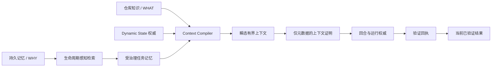

# Agent Memory Bridge

[English](README.md)

[](https://modelcontextprotocol.io)
[](https://github.com/zzhang82/Agent-Memory-Bridge/actions/workflows/ci.yml)
[](https://github.com/zzhang82/Agent-Memory-Bridge/releases)
[](LICENSE)
[](pyproject.toml)

**Agent Memory Bridge（AMB）**是面向 AI 编码智能体的本地优先共享项目记忆层。代码告诉 AMB 项目是什么；对话教会 AMB 项目为什么如此。派生的仓库 **WHAT** 与受治理的持久项目 **WHY** 保持分离，并通过精简的本地 MCP 接口跨工具、跨会话提供。

当前源码版本：`0.32.0`

已发布版本：请见 [GitHub Releases](https://github.com/zzhang82/Agent-Memory-Bridge/releases)

> AMB 补充而非替代 `AGENTS.md`、`CLAUDE.md` 与客户端原生偏好记忆。它不是托管式智能体运行时、调度器、队列，也不是通用记忆平台。

## 为什么需要 AMB

编码智能体很容易在会话、客户端和交接之间遗失有价值的工程知识。普通摘要会过期；不透明的检索会掩盖条目为何被选择；可变的运行状态也不应被误认为持久知识。

AMB 将这些问题分开处理：它存储可检查的工程记忆，在组装任务上下文之前应用生命周期感知的治理，并通过独立权威边界维护精确键的可变状态，同时让面向提示词的上下文保持瞬态。

## AMB 提供什么

| 能力 | 含义 |
|---|---|
| 持久工程记忆 | 用于决策、经验教训、过程、概念、信念、支持性证据和协作信号的本地记录。 |
| 生命周期感知检索 | 在指导信息被用于任务之前，应用资格、修订、替代、有效期、关系和治理边界。 |
| Dynamic State 权威 | 内部精确键发布状态通道，使用版本与数据库纪元前置条件；它不是语义记忆。 |
| 受治理的任务记忆组装 | 任务时选择来自既有受治理记忆路径，而不是第二套检索系统。 |
| 瞬态 Context Compiler | 基于仓库派生 WHAT、受治理任务记忆、Dynamic State 快照和显式会话局部条目的有界确定性派生视图。 |
| 回合与验证证据 | 显式运行、工件、结果和回执支持可复核的证据，而不宣称因果关系或自动学习。 |
| 跨客户端 MCP 访问 | 面向已支持和已文档化 MCP 客户端的稳定本地 stdio 接口。 |
| 仓库知识 / WHAT | 派生、有界、可重建、按命名空间绑定的仓库事实。只有在确认工作区干净时才按提交绑定；过期或不可用状态会 fail closed，普通 MCP 召回只暴露有界的已选择 WHAT。 |
| 持久项目记忆 / WHY | 受治理的持久记忆仍保留在普通召回的 `items` 中，并保留记忆 ID、回执和生命周期权威；仓库事实不会变成持久记忆记录。 |

AMB **不会**自动把经验写回记忆、根据反馈改变排序、提升自生成反思，也不会自主获得技能。

## 如何工作


```mermaid
flowchart LR
    A[持久记忆 / WHY] --> C[生命周期感知检索]
    B[仓库知识 / WHAT] --> D[Context Compiler]
    S[Dynamic State 权威] --> D
    C --> E[受治理任务记忆]
    E --> D
    D --> F[瞬态有界上下文]
    F --> G[仅元数据的上下文证明]
    G --> H[回合与运行权威]
    H --> I[验证回执]
    I --> J[当前已验证结果]
```

上下文主体在进程中渲染；编译器不会将其持久化。证明仅存储有界元数据和摘要，而不是面向提示词的主体。被选择的上下文不证明记忆已被使用，记忆被使用也不证明其导致了结果。

完整的权威与数据流说明请阅读[架构](docs/ARCHITECTURE.md)。

## 快速开始

AMB 在本地运行，需要 **Python 3.11+**、支持 FTS5 的 SQLite，以及能启动本地 stdio 服务的 MCP 客户端。

当前源码/包版本为 `0.32.0`。使用源码检出时可运行 `<venv-python> -m pip install -e .` 评估精确检出。已发布版本和固定归档请见 [GitHub Releases](https://github.com/zzhang82/Agent-Memory-Bridge/releases)。GitHub Release 是否已发布，以该 Releases 页面的实时状态为准；不存在 `pip install agent-memory-bridge==0.32.0` 安装路径。

### 1. 把 AMB 连接到编码客户端

```bash
python -m venv .amb-venv
<venv-python> -m pip install -e .
<venv-python> -m agent_mem_bridge setup --client generic
```

使用生成的客户端配置并重新加载客户端。`setup` 负责连接与配置规划。

### 2. 初始化仓库 WHAT

```bash
<venv-python> -m agent_mem_bridge project init .
```

Project Init 会检测本地 Git 仓库、提出类似 `project:my-app` 的命名空间，并在写入前要求明确确认。确认后它复用现有的 `bootstrap-repo` 绑定派生的仓库 WHAT，然后显示 Human-first Explore。它不会自动学习决策。

底层原语仍然可用：

```bash
<venv-python> -m agent_mem_bridge bootstrap-repo . \
  --namespace project:my-app
```

AMB 从当前仓库派生出一份有界、可重建的视图。

**代码告诉 AMB 项目“是什么”（WHAT）。**

### 3. 用自然语言教会一条项目 WHY

在已连接的编码智能体里，直接说类似这样的话：

> 请记住：我们决定不引入 Redis，因为这个项目刻意保持本地优先、单节点。

已连接的智能体会用 AMB 现有的公共记忆工具保存这条明确的决策和理由。人类快速开始不需要填写内部记录 schema。

**对话告诉 AMB 项目“为什么这样”（WHY）。**

AMB 不会从仓库代码静默推断持久决策，不会自动提升对话文本，也不会归档转录。

### 4. 用新会话验证

打开或重新打开一个使用同一 AMB 主目录和数据库的编码智能体会话。提出相关问题，然后使用 Inspect 和 Explore。

**Inspect** 回答：这次问题里，AMB 为什么会给出这些信息？

```bash
<venv-python> -m agent_mem_bridge inspect \
  --namespace project:my-app \
  --query "Should we add Redis?"
```

Inspect 解释该问题对应的受治理结果。它不会列出全部持久记录，不会改写记忆，也不能证明模型实际使用了某条记忆。

**Explore** 回答：AMB 目前知道这个项目的哪些内容，它们如何关联？

```bash
<venv-python> -m agent_mem_bridge explore \
  --namespace project:my-app
```

Explore 是基于现有项目知识的本地、只读派生投影。默认 Markdown 是人类可读的项目一页视图。若还没有项目决策或约束，它会提示你告诉已连接的编码智能体：记住我们决定了 X，因为 Y。默认视图不会显示 `depends_on`、`supports`、`contradicts` 这类图动词；这些仍留在 `--format markdown --technical` 和 JSON 中。JSON 保持不变。Explore 仅提供 CLI，不是 MCP 工具 #18，也不会为模型排序上下文。

### 项目知识心智模型

这是概念视图，不是当前 CLI 的逐字输出：

```text
PROJECT: MY APP

CODE / WHAT                  CONVERSATION / WHY
───────────                  ──────────────────
Runtime: Python >=3.11       Decision: Avoid Redis
Tests: pytest                Reason: single-node,
CI: GitHub Actions           local-first project
Container: Docker
Guidance: AGENTS.md
```

仓库 WHAT 来自当前干净代码。它可以重建，但不是人类决策权威。

对话 WHY 是通过 AMB 保存的明确决策或约束。它是受治理的持久项目记忆。

Explorer 是现有知识的只读投影，不是新的权威来源。

更完整的权威说明见[项目知识激活](docs/PROJECT-KNOWLEDGE-ACTIVATION.md)和[架构](docs/ARCHITECTURE.md)。

### 当仓库 WHAT 不可用时

**脏工作区。** 检出含有未提交更改时，仓库 WHAT 暂时不可用。AMB 不会把这些更改归因到当前 Git 提交。请先提交、暂存或恢复工作区，然后显式重新运行 `bootstrap-repo`。

**干净 HEAD 已变化。** 保存快照之后 HEAD 已变化，仓库 WHAT 暂时过期。

先前快照：`<old SHA>`

当前干净 HEAD：`<new SHA>`

AMB 不会把旧快照当作当前仓库真相。请显式重新运行：

```bash
<venv-python> -m agent_mem_bridge bootstrap-repo . \
  --namespace project:<name>
```

随后仓库 WHAT 会刷新，持久项目 WHY 保持不变。刷新不是自动发生的。

**缺少绑定。** 当前没有找到该项目命名空间的仓库绑定。可运行 `project init .` 检测检出并确认建议的命名空间，或自行选择命名空间后运行：

```bash
<venv-python> -m agent_mem_bridge bootstrap-repo . \
  --namespace project:<name>
```

### 用本仓库做一次演示

把 AMB 连接到共享同一 AMB 主目录的客户端后：

```bash
<venv-python> -m agent_mem_bridge project init . --namespace project:amb --yes
```

用自然语言教会：

> 请记住：我们决定不给 Knowledge Explorer 使用图数据库，因为 Explorer 应保持为派生的只读投影。

打开新会话，问“Should Knowledge Explorer use a graph database?”，然后运行 Inspect 和 Explore。这证明一条明确决策可以被恢复，并不宣称生产力，也不证明模型使用了该记忆。

### 可选的引导式记忆循环

`first-run` 仍可作为次要的引导式持久记忆帮助。它不是现代 Project Learning 的入口。

```bash
<venv-python> -m agent_mem_bridge first-run --namespace project:my-app --query "What should I check before submitting changes?"
```

### 如果连接健康状态不确定

`doctor` 和 `verify` 是可选的健康检查与排障命令。引导仓库 WHAT 之前不需要先运行它们。

```bash
<venv-python> -m agent_mem_bridge doctor
<venv-python> -m agent_mem_bridge verify
```

详细智能体流程请使用[面向智能体的安装指南](INSTALL_FOR_AGENTS.md)、[安装说明](llms-install.md)、[集成](docs/INTEGRATIONS.md)和[配置](docs/CONFIGURATION.md)。


## 集成

AMB 是本地 stdio MCP 服务器。通用 stdio MCP 受支持；Codex 是参考工作流；Claude Code、Claude Desktop、Cursor 和 Cline 已有文档；Antigravity、OpenCode 与 Hermes 已有本地测试的配置路径。集成状态标签刻意保持严格，不代表宿主认证。

客户端专用配置和边界请见[集成](docs/INTEGRATIONS.md)。

## 信任与隐私

SQLite/WAL 是本地持久权威。FTS5 与可选的本地嵌入是派生索引，不是记忆权威。Dynamic State 与语义记忆分离。运行工件仅保留有界元数据；AMB 会拒绝将原始转录、隐藏推理和内联工件主体写入持久回合路径。

详细边界请见[权威契约](docs/AUTHORITY-CONTRACT.md)、[信任边界](docs/TRUST-BOUNDARY.md)和[闭环回合权威](docs/CLOSED-LOOP-EPISODE.md)。

## MCP 工具

AMB 提供 **17 个公共 MCP 工具**：

- `store`、`recall`、`browse` 和 `stats`
- `forget`、`feedback`、`promote`、`annotate`、`revise` 和 `export`
- `begin_run`、`record_run_event`、`get_run` 和 `complete_run`
- `claim_signal`、`extend_signal_lease` 和 `ack_signal`

公共接口刻意保持精简。上下文组装、审查报告和其他派生视图在这些工具之后演进，而不会增加单独的任务包或上下文编译器工具。本地协议缓存契约为 discovery 的 `300000/public` 与工具列表的 `0/private`；详细内容请见 [MCP 兼容性](docs/MCP-2026-COMPATIBILITY.md)。

## 文档

| 从这里开始 | 用途 |
|---|---|
| [架构](docs/ARCHITECTURE.md) | 当前高层系统与权威流。 |
| [生产状态](docs/PRODUCTION-STATUS.md) | 当前源码事实、已实现能力摘要、验证证据和已知边界。 |
| [能力历史](CHANGELOG.md) | 持久的历史能力里程碑，以及保留的证明和证据引用。 |
| [面向智能体的安装指南](INSTALL_FOR_AGENTS.md) | 从安装到首次成功的详细流程。 |
| [项目知识激活](docs/PROJECT-KNOWLEDGE-ACTIVATION.md) | 仓库 WHAT、持久 WHY，以及显式刷新规则。 |
| [Knowledge Explorer](docs/KNOWLEDGE-EXPLORER.md) | 当前项目知识的只读派生视图。 |
| [集成](docs/INTEGRATIONS.md) | 客户端专用本地 stdio MCP 设置。 |
| [配置](docs/CONFIGURATION.md) | 完整配置参考。 |
| [权威契约](docs/AUTHORITY-CONTRACT.md) | 持久权威、派生视图、审查和纠正规则。 |
| [信任边界](docs/TRUST-BOUNDARY.md) | 本地信任、来源、隐私与非目标。 |
| [示例](examples/README.md) | 已净化的示例与演示。 |

## 当前成熟度

当前源码版本为 `0.32.0`，使用 schema v12 和冻结的 17 工具 MCP 接口。默认 Explore 是面向人的项目一页视图，覆盖现有 WHAT 与 WHY。`project init` 是首选的首次项目路径；`bootstrap-repo` 仍是显式底层原语。已检入的源码事实、验证证据和非声明由[生产状态](docs/PRODUCTION-STATUS.md)维护。实时 CI 请查看 [GitHub Actions](https://github.com/zzhang82/Agent-Memory-Bridge/actions) 或上方 CI badge；已发布版本请查看 [GitHub Releases](https://github.com/zzhang82/Agent-Memory-Bridge/releases) 或上方 release badge。

## 路线图

未来方向按能力组织，并刻意保持保守。请见[路线图](docs/ROADMAP.md)；历史公告仍是证据，而不是理解当前产品故事的必读材料。

## 贡献与安全

请阅读[CONTRIBUTING.md](CONTRIBUTING.md)了解开发与公共表面要求，并阅读[SECURITY.md](SECURITY.md)了解本地优先安全模型和漏洞报告流程。

采用 [MIT](LICENSE) 许可证。
