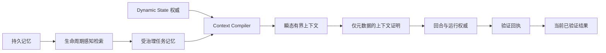

# Agent Memory Bridge

[English](README.md)

[](https://modelcontextprotocol.io)
[](https://github.com/zzhang82/Agent-Memory-Bridge/actions/workflows/ci.yml)
[](https://github.com/zzhang82/Agent-Memory-Bridge/releases)
[](LICENSE)
[](pyproject.toml)

**Agent Memory Bridge（AMB）**为编码智能体提供一份跨工具、跨会话共享且受治理的工程知识记录。它以 SQLite/WAL 为本地优先的权威存储，通过刻意保持精简的 MCP 接口提供能力。

当前源码发布版本：`0.28.0`

> AMB 补充而非替代 `AGENTS.md`、`CLAUDE.md` 与客户端原生偏好记忆。它不是托管式智能体运行时、调度器、队列，也不是通用记忆平台。

## 为什么需要 AMB

编码智能体很容易在会话、客户端和交接之间遗失有价值的工程知识。普通摘要会过期；不透明的检索会掩盖条目为何被选择；可变的运行状态也不应被误认为持久知识。

AMB 将这些问题分开处理：它存储可检查的工程记忆，在组装任务上下文之前应用生命周期感知的治理，并通过独立权威边界维护精确键的可变状态，同时让面向提示词的上下文保持瞬态。

## AMB 提供什么

| 能力 | 含义 |
|---|---|
| 持久工程记忆 | 用于决策、经验教训、过程、概念、信念、支持性证据和协作信号的本地记录。 |
| 生命周期感知检索 | 在指导信息被用于任务之前，应用资格、修订、替代、有效期、关系和治理边界。 |
| Dynamic State 权威 | 内部精确键发布状态通道，使用版本与数据库纪元前置条件；它不是语义记忆。 |
| 受治理的任务记忆组装 | 任务时选择来自既有受治理记忆路径，而不是第二套检索系统。 |
| 瞬态 Context Compiler | 基于受治理任务记忆、Dynamic State 快照和显式会话局部条目的有界确定性派生视图。 |
| 回合与验证证据 | 显式运行、工件、结果和回执支持可复核的证据，而不宣称因果关系或自动学习。 |
| 跨客户端 MCP 访问 | 面向已支持和已文档化 MCP 客户端的稳定本地 stdio 接口。 |

AMB **不会**自动把经验写回记忆、根据反馈改变排序、提升自生成反思，也不会自主获得技能。

## 如何工作


```mermaid
flowchart LR
    A[持久记忆] --> C[生命周期感知检索]
    B[Dynamic State 权威] --> D[Context Compiler]
    C --> E[受治理任务记忆]
    E --> D
    D --> F[瞬态有界上下文]
    F --> G[仅元数据的上下文证明]
    G --> H[回合与运行权威]
    H --> I[验证回执]
    I --> J[当前已验证结果]
```

上下文主体在进程中渲染；编译器不会将其持久化。证明仅存储有界元数据和摘要，而不是面向提示词的主体。被选择的上下文不证明记忆已被使用，记忆被使用也不证明其导致了结果。

完整的权威与数据流说明请阅读[架构](docs/ARCHITECTURE.md)。

## 快速开始

AMB 在本地运行，需要 **Python 3.11+**、支持 FTS5 的 SQLite，以及能启动本地 stdio 服务的 MCP 客户端。

```bash
python -m venv .amb-venv
<venv-python> -m pip install -e .
<venv-python> -m agent_mem_bridge setup --client generic
<venv-python> -m agent_mem_bridge first-run --namespace project:my-app --query "What should I check before submitting changes?"
```

随后使用生成的客户端配置，重新加载客户端，并运行：

```bash
<venv-python> -m agent_mem_bridge doctor
<venv-python> -m agent_mem_bridge verify
```

`setup` 负责连接/配置规划与安全应用；`doctor`/`verify` 检查运行时健康；`first-run` 引导第一次有用的记忆循环；`inspect` 提供日常解释视图。当前源码候选版本为 `0.28.0`，尚未创建标签或发布；发布后的固定安装路径将使用 `v0.28.0`，当前已发布版本状态以 GitHub Releases 为准。详细流程请使用[面向智能体的安装指南](INSTALL_FOR_AGENTS.md)、[安装说明](llms-install.md)、[集成](docs/INTEGRATIONS.md)和[配置](docs/CONFIGURATION.md)。

## 检查一次召回决策

当 AMB 已给出任务记忆时，可以用只读命令检查日常证据：

```bash
agent-memory-bridge inspect \\
  --namespace project:my-app \\
  --query "What should I check before submitting changes?"
```

报告会展示已出现的内容、基于现有证据的原因、相关的治理排除项以及需要人工复核的项目。它不会列出数据库中的全部记录，不会改变持久记忆、状态或配置，也不会证明某条出现的记忆被实际应用或导致某个结果。

## 集成

AMB 是本地 stdio MCP 服务器。通用 stdio MCP 受支持；Codex 是参考工作流；Claude Code、Claude Desktop、Cursor 和 Cline 已有文档；Antigravity、OpenCode 与 Hermes 已有本地测试的配置路径。集成状态标签刻意保持严格，不代表宿主认证。

客户端专用配置和边界请见[集成](docs/INTEGRATIONS.md)。

## 信任与隐私

SQLite/WAL 是本地持久权威。FTS5 与可选的本地嵌入是派生索引，不是记忆权威。Dynamic State 与语义记忆分离。运行工件仅保留有界元数据；AMB 会拒绝将原始转录、隐藏推理和内联工件主体写入持久回合路径。

详细边界请见[权威契约](docs/AUTHORITY-CONTRACT.md)、[信任边界](docs/TRUST-BOUNDARY.md)和[闭环回合权威](docs/CLOSED-LOOP-EPISODE.md)。

## MCP 工具

AMB 提供 **17 个公共 MCP 工具**：

- `store`、`recall`、`browse` 和 `stats`
- `forget`、`feedback`、`promote`、`annotate`、`revise` 和 `export`
- `begin_run`、`record_run_event`、`get_run` 和 `complete_run`
- `claim_signal`、`extend_signal_lease` 和 `ack_signal`

公共接口刻意保持精简。上下文组装、审查报告和其他派生视图在这些工具之后演进，而不会增加单独的任务包或上下文编译器工具。本地协议缓存契约为 discovery 的 `300000/public` 与工具列表的 `0/private`；详细内容请见 [MCP 兼容性](docs/MCP-2026-COMPATIBILITY.md)。

## 文档

| 从这里开始 | 用途 |
|---|---|
| [架构](docs/ARCHITECTURE.md) | 当前高层系统与权威流。 |
| [生产状态](docs/PRODUCTION-STATUS.md) | 当前源码事实、已实现能力摘要、验证证据和已知边界。 |
| [能力历史](CHANGELOG.md) | 持久的历史能力里程碑，以及保留的证明和证据引用。 |
| [面向智能体的安装指南](INSTALL_FOR_AGENTS.md) | 从安装到首次成功的详细流程。 |
| [集成](docs/INTEGRATIONS.md) | 客户端专用本地 stdio MCP 设置。 |
| [配置](docs/CONFIGURATION.md) | 完整配置参考。 |
| [权威契约](docs/AUTHORITY-CONTRACT.md) | 持久权威、派生视图、审查和纠正规则。 |
| [信任边界](docs/TRUST-BOUNDARY.md) | 本地信任、来源、隐私与非目标。 |
| [示例](examples/README.md) | 已净化的示例与演示。 |

## 当前成熟度

当前源码使用 schema v12 和冻结的 17 工具 MCP 接口。已检入的源码事实、验证证据和非声明由[生产状态](docs/PRODUCTION-STATUS.md)维护。实时 CI 请查看 [GitHub Actions](https://github.com/zzhang82/Agent-Memory-Bridge/actions) 或上方 CI badge；已发布版本请查看 [GitHub Releases](https://github.com/zzhang82/Agent-Memory-Bridge/releases) 或上方 release badge。

## 路线图

未来方向按能力组织，并刻意保持保守。请见[路线图](docs/ROADMAP.md)；历史公告仍是证据，而不是理解当前产品故事的必读材料。

## 贡献与安全

请阅读[CONTRIBUTING.md](CONTRIBUTING.md)了解开发与公共表面要求，并阅读[SECURITY.md](SECURITY.md)了解本地优先安全模型和漏洞报告流程。

采用 [MIT](LICENSE) 许可证。
