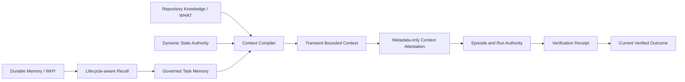

<p align="center">
  
</p>

<h1 align="center">Agent Memory Bridge</h1>

<p align="center"><strong>把项目决策带到下一次编码会话。</strong></p>

<p align="center">
  AMB 帮助编码智能体记住真正重要的决策——跨会话、跨工具，也跨时间。
</p>

<p align="center"><a href="README.md">English</a></p>

<p align="center">
  <a href="https://pypi.org/project/agent-memory-bridge/"></a>
  <a href="https://modelcontextprotocol.io"></a>
  <a href="https://github.com/zzhang82/Agent-Memory-Bridge/actions/workflows/ci.yml"></a>
  <a href="https://github.com/zzhang82/Agent-Memory-Bridge/releases"></a>
  <a href="LICENSE"></a>
  <a href="pyproject.toml"></a>
</p>

```bash
pip install agent-memory-bridge
```

**AMB 只需要安装一次，但每个编码客户端都要分别连接。** 安装 Python 包不会自动把 AMB 注册到所有编码智能体里。你想使用的每个客户端都需要配置为通过 MCP stdio 启动 AMB；如果多个客户端要共享同一份记忆，它们需要指向同一个已配置的本地 AMB home。

## 你的项目不该在每个新会话里重新开始

一个项目远不只是当前那一份文件。随着时间推移，真正有用的上下文会散落在仓库、聊天、编码智能体、review、修复记录和一次次临时决策里。新会话也许能看到代码，却仍然不知道那些让项目成立的理由。

AMB 给这些决策一个可以长期保存的位置。第一次成功很简单：教给它一个真实决策，关掉会话，打开一个全新的编码智能体会话，再听到 AMB 把同一个决策带回来。

| 没有共享项目记忆 | 使用 AMB |
|---|---|
| 每个会话都重新拼上下文 | 有价值的项目知识可以继续沿用 |
| 决策消失在旧聊天里 | 明确记录的决策和理由跟着项目走 |
| 不同工具各自形成残缺理解 | 支持的 MCP 客户端可以共用同一个本地 AMB home |
| 记忆可能过期、冲突或含义不清 | provenance、修订、supersession 和 inspection 让它保持可治理 |

AMB 本地优先，而且可检查。它不会默默归档每一段对话，也不会把所有“记住的内容”都当成同等权威的事实。

## 快速开始

AMB 需要 **Python 3.11+**、Git，以及能够启动本地 stdio server 的 MCP 兼容编码客户端。

当前包/源码版本：`0.33.1`。

已发布版本请见 [GitHub Releases](https://github.com/zzhang82/Agent-Memory-Bridge/releases)。

第一次成功发生在编码智能体里，而且必须是一个全新会话。CLI Explore/Inspect 以及 `doctor`/`verify` 是后续检查，不是这次成功本身。

### 1. 安装 AMB

快速开始建议使用虚拟环境，让所有编码客户端都能指向一个稳定的 Python launcher。请根据操作系统，用 `.amb-venv` 中的 Python 可执行文件代替 `<venv-python>`。

```bash
python -m venv .amb-venv
<venv-python> -m pip install agent-memory-bridge==0.33.1
```

如果是在开发或审计一个精确源码检出，请使用：

```bash
<venv-python> -m pip install -e .
```

### 2. 连接你实际使用的编码客户端

安装 AMB 和把客户端注册到 AMB 是两件事。先只预览一个客户端的设置方案：

```bash
<venv-python> -m agent_mem_bridge setup --client <client>
```

`setup` 默认只读：它只会在有边界的客户端配置位置做检测或检查，并展示建议的 AMB 配置片段或下一步动作，不会直接写配置。`<client>` 可以使用 `codex`、`claude-code`、`vscode`、`cursor`、`cline`、`opencode`，或[集成文档](docs/INTEGRATIONS.md)中列出的其他支持客户端。Codex 是参考工作流。

如果预览结果明确标记该客户端可以进行安全自动配置，可以在检查后显式执行：

```bash
<venv-python> -m agent_mem_bridge setup --client <client> --apply
```

有些客户端仍然只支持 preview/manual，因为 AMB 不会猜测不安全的配置路径，也不会冒险重写不适合自动修改的格式。这时请复制生成的配置片段，或按对应的[集成指南](docs/INTEGRATIONS.md)完成设置。你要使用几个编码客户端，就分别重复这一步几次；如果它们要共享同一份项目记忆，请让它们都指向同一个 `AGENT_MEMORY_BRIDGE_HOME`，完成注册后再重载对应客户端。

只有编码客户端自己列出了 `store`、`recall` 这些 AMB 工具，才算连接成功。`doctor` 和 `verify` 不能证明外部客户端已经加载了 MCP 配置。

### 3. 初始化项目

```bash
<venv-python> -m agent_mem_bridge project init .
```

Project Init 会检测本地 Git 仓库，建议一个类似 `project:my-app` 的 namespace，并等待你确认。随后它会派生当前仓库 baseline。它不会自动学习项目决策。

### 4. 教给项目一个真实决策

在已连接的编码智能体里，告诉它一个你真正做过的决策。例如：

> 记住：我们只在目标分支 CI 全绿之后才合并 pull request，因为主分支坏掉已经耽误了两次发布。

已连接的智能体会使用 AMB 公开的 `store` 工具，保存这项明确决策及其理由。AMB 不会从代码中推断出持久决策，也不会归档整段对话。

另一个有效例子是技术选型，例如继续保持本地优先、不引入 Redis。成功标准是“决策 + 理由”，而不是某一种技术本身。

### 5. 关掉当前会话，再在全新会话里问一次

彻底结束第一个智能体会话。用同一个项目、同一套客户端注册、同一个 AMB home 打开新会话，然后问一个普通问题：

> 合并 pull request 之前必须满足什么条件？

第一次成功，是新会话因为 AMB 召回了记忆，而答出刚才那条决策和理由。在 CLI Explore 或 Inspect 里看到同一条事实，只是事后审阅，不是这次成功的判定标准。

Codex 的完整观察步骤见[首次成功验收](docs/FIRST-WIN-ACCEPTANCE.md)。

## 第一次成功之后

当一条决策能在全新会话里活下来之后，你再检查 AMB 目前知道什么、刷新仓库事实，并使用下面的治理模型。

<details>
<summary>可选的审阅、刷新与故障排查</summary>

Human-first Explore 回答“AMB 目前知道这个项目的什么信息？”Inspect 回答“为什么这条信息会针对这个问题出现？”两者都只在本地读取，不会修改记忆。

```bash
<venv-python> -m agent_mem_bridge explore \
  --namespace project:my-app

<venv-python> -m agent_mem_bridge inspect \
  --namespace project:my-app \
  --query "What is required before we merge a pull request?"
```

下面是概念视图，不是 CLI 的逐字输出：

```text
CODE / WHAT                     CONVERSATION / WHY
────────────────────            ──────────────────────────
Runtime: Python >=3.11          Decision: 只在 CI 全绿后合并
Package: my-app                 Reason: 主分支坏掉耽误了
Tests: pytest                   两次发布
```

**代码告诉 AMB 项目“是什么”（WHAT）。**

**对话告诉 AMB 项目“为什么这样”（WHY）。**

这个区分是一条**信任边界**：派生事实可以从当前代码重新构建，而持久项目知识则保持显式、可审阅、可治理。

仓库 WHAT 来自干净的 Git commit。如果 HEAD 发生变化或 worktree 不干净，AMB 不会把旧 snapshot 当作当前事实。刷新不是自动发生的。请重新运行显式底层命令：

```bash
<venv-python> -m agent_mem_bridge bootstrap-repo . \
  --namespace project:<name>
```

刷新仓库 WHAT 不会改变持久项目 WHY。Explore 只属于 CLI，不是 MCP 工具 #18，也不会为模型排序上下文。

`first-run` 仍可作为可选引导，但它不是第一次成功的路径：

```bash
<venv-python> -m agent_mem_bridge first-run --namespace project:my-app --query "What should I remember?"
```

只有在安装或连接状态不确定时才需要运行。它们不能证明编码客户端已经加载 MCP 配置：

```bash
<venv-python> -m agent_mem_bridge doctor
<venv-python> -m agent_mem_bridge verify
```

</details>

## 集成

AMB 通过本地 stdio MCP 工作。它支持通用 MCP 客户端；Codex 是参考工作流；Claude Code、Claude Desktop、Cursor 和 Cline 已有文档；Antigravity、OpenCode 和 Hermes 则有本地实测配置路径。

这些集成标签有意保持窄口径，不代表客户端认证。当前设置方式和边界请见[集成文档](docs/INTEGRATIONS.md)。

## 为什么这份记忆能保持可信

长期项目记忆真正有价值的地方，不只是“记得更多”，而是能够知道一条知识从哪里来、现在是否仍然有效，以及它后来发生过什么变化。

因此 AMB 会明确保留这些边界：

| 记忆问题 | AMB 的处理方式 |
|---|---|
| 当前仓库事实 | 从干净仓库状态派生，并显式刷新 |
| 人做出的决策和约束 | 作为受治理的持久记忆显式保存 |
| 已经变化的知识 | 通过修订或 supersession 演化，而不是静默覆盖 |
| 某段上下文为什么出现 | 可通过本地派生视图与 evidence path 检查 |
| 跨会话复用 | 通过同一个已配置的本地 AMB home 共享 |
| 隐私 | 本地优先，不要求托管式记忆服务 |

之前的 **WHAT / WHY** 模型应该放在这里：它解释了 AMB 如何让记忆保持可信的一部分机制，而不是用来定义整个产品。

## AMB 是什么——以及不是什么

AMB 是面向编码智能体的、受治理的本地项目记忆层。它让有价值的上下文能够跨会话、跨工具保留下来，同时继续区分持久知识、仓库派生事实、provenance 与后续修正。

它不是聊天记录归档器，不承诺智能体会记住所有事情，也不会默默把每一段对话都转换成持久事实。它没有自动学习。

## 想了解细节？

| 文档 | 用途 |
|---|---|
| [首次成功验收](docs/FIRST-WIN-ACCEPTANCE.md) | Codex 首次成功的精确观察包 |
| [架构](docs/ARCHITECTURE.md) | 系统形态与数据流 |
| [权威模型](docs/AUTHORITY-CONTRACT.md) | 持久权威、派生视图、修正与审计规则 |
| [Knowledge Explorer](docs/KNOWLEDGE-EXPLORER.md) | 面向人的只读项目视图 |
| [生产状态](docs/PRODUCTION-STATUS.md) | 当前实现事实、证据与已知边界 |
| [集成](docs/INTEGRATIONS.md) | 针对不同客户端的本地 MCP 设置 |
| [智能体安装指南](INSTALL_FOR_AGENTS.md) | 从安装到首次成功的完整流程 |
| [规范记忆调用策略](docs/SEMANTIC-MEMORY-POLICY.md) | 主机何时应查询项目记忆 |
| [配置](docs/CONFIGURATION.md) | 完整配置参考 |
| [示例](examples/README.md) | 脱敏 Demo 与工件 |

## 技术模型

上面的产品叙事有意把实现词汇后置。在内部，AMB 仍将 `derived_repository` 数据与受治理的持久记忆分开，避免一方悄悄变成另一方。对维护者和审阅者，当前权威流如下：


```mermaid
flowchart LR
    A[Durable Memory / WHY] --> C[Lifecycle-aware Recall]
    B[Repository Knowledge / WHAT] --> D[Context Compiler]
    S[Dynamic State Authority] --> D
    C --> E[Governed Task Memory]
    E --> D
    D --> F[Transient Bounded Context]
    F --> G[Metadata-only Context Attestation]
    G --> H[Episode and Run Authority]
    H --> I[Verification Receipt]
    I --> J[Current Verified Outcome]
```

SQLite/WAL 记录是持久权威。仓库 snapshot、FTS 记录、embedding sidecar、编译上下文、报告和 Explorer 视图都是派生内容。Context Compiler 只在进程内渲染上下文正文，不会将其持久保存。

## 信任与隐私

AMB 本地优先，不依赖托管式记忆服务。它将持久记忆、协作 Signal 和可变 Dynamic State 分开，保留可见 provenance，并拒绝把原始 transcript、隐藏推理或内联 artifact body 写入持久 episode 通道。

精确边界请见[信任边界](docs/TRUST-BOUNDARY.md)、[权威契约](docs/AUTHORITY-CONTRACT.md)和[闭环 Episode 权威](docs/CLOSED-LOOP-EPISODE.md)。

## MCP 工具

AMB 暴露 **17 个公开 MCP 工具**：

- `store`、`recall`、`browse`、`stats`
- `forget`、`feedback`、`promote`、`annotate`、`revise`、`export`
- `begin_run`、`record_run_event`、`get_run`、`complete_run`
- `claim_signal`、`extend_signal_lease`、`ack_signal`

公开工具接口保持精简。Setup、Project Init、Explore、Inspect、上下文组装和审阅报告继续作为 CLI 或内部派生工作流，而不会变成更多 MCP 工具。

本地协议缓存契约为：discovery 使用 `300000/public`，工具列表使用 `0/private`。详情请见 [MCP 兼容性](docs/MCP-2026-COMPATIBILITY.md)。

## 当前成熟度

当前包/源码版本是 `0.33.1`。schema 仍为 v12，公开 MCP 接口仍是恰好 17 个工具。没有自动学习，也没有 MCP 工具 #18。`project init` 是首选的首次项目路径。默认 Explore 是覆盖现有仓库派生上下文与受治理项目知识的 Human-first 视图。当前证据与非声明位于[生产状态](docs/PRODUCTION-STATUS.md)，已发布工件位于 [GitHub Releases](https://github.com/zzhang82/Agent-Memory-Bridge/releases)。

## 参与贡献

开发和公开接口要求请见 [CONTRIBUTING.md](CONTRIBUTING.md)，漏洞报告方式请见 [SECURITY.md](SECURITY.md)。

项目采用 [MIT](LICENSE) 许可证。