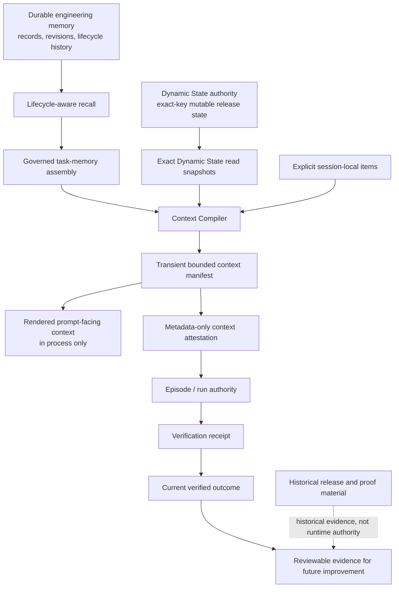

# Architecture

Agent Memory Bridge (AMB) is a **local-first, governed engineering-memory bridge** for coding agents. Its architecture keeps durable authority separate from rebuildable views, transient prompt context, and historical evidence. This page is the high-level entrypoint; the linked references remain the detailed contracts.

> **Authority rule:** a useful rendering, receipt, report, or historical announcement does not become runtime authority merely because it exists. Durable records and their explicit contracts remain the source of truth.

## The System in One View

The diagram shows an authority chain, not an automatic-learning loop. A selected context does **not** prove that an agent applied a memory; an applied memory does **not** prove that it caused an outcome; and outcome evidence does **not** automatically write lessons back into memory.

## Four Kinds of Information

| Kind | What it contains | Authority and retention boundary |
|---|---|---|
| **Durable authority** | Engineering-memory records and their revision/lifecycle history; exact-key Dynamic State mutations and state-head authority; run, work-item, event, artifact, outcome, and verification-receipt authority. | Stored through the existing SQLite/WAL authority boundaries. These records determine what can be recovered, evaluated, or corrected later. |
| **Derived / rebuildable views** | FTS5 and optional embedding indexes, lifecycle-aware recall results, governed task-memory assembly, projections, reports, and read-only evaluation linkage. | Rebuildable from durable authority and code. They assist inspection or selection but do not own memory, mutable state, or outcome authority. |
| **Transient data** | Rendered compiled context, prompt-facing context bodies, and explicit in-process session-local material used for one compilation. | The Context Compiler does not persist rendered context or introduce a prompt archive. A manifest serializes selection metadata, not context bodies. |
| **Historical evidence** | Release announcements, benchmark snapshots, proof artifacts, and prior acceptance evidence. | Useful for provenance and review, but not current runtime authority or a substitute for the current product documentation. |

## Durable Authority

### Engineering memory is durable, correctable knowledge

AMB stores local engineering memory such as decisions, gotchas, procedures, concepts, beliefs, supporting records, and coordination signals. Revisions, supersession, deletion, validity, and applicability are part of the durable record model. The system can suppress stale, superseded, unsafe, or inapplicable records before they are used as task context.

This does not make stored memory immutable or universally applicable. Humans can correct, replace, or remove records through the governed paths described in the [authority contract](AUTHORITY-CONTRACT.md). Durable memory is distinct from mutable operational state.

### Dynamic State is a separate logical authority boundary

Dynamic State is an internal, exact-key release-state lane over the existing local store. It owns typed state transitions, owner assignment, restore-as-a-new-version, optimistic version and database-epoch preconditions, idempotency outcomes, immutable accepted mutations, and a rebuildable current-head projection.

It is **not** semantic memory, retrieval ranking, an embedding index, or a second recall system. Context compilation receives exact `DynamicStateStore.read()` snapshots—identity, version, value hash, and database epoch—rather than duplicating or inferring state from memory.

### Episode and verification authority are durable evidence

A run and its work items, events, artifacts, outcomes, and memory-attribution links form the durable episode record. Verification receipts bind governed evidence to an outcome. The current outcome is the head of an append-only correction chain; a strong verified outcome requires the existing governed verification conditions.

Detailed behavior, privacy constraints, and outcome rules remain in the [episode authority contract](CLOSED-LOOP-EPISODE.md) and the [trust boundary](TRUST-BOUNDARY.md).

## Derived Context Path

### Lifecycle-aware recall and governed task memory

Recall and task-memory assembly are responsible for governed selection over durable memory. Lifecycle-aware eligibility and relation-aware suppression happen before the Context Compiler receives its task-memory report. This preserves one governed memory-selection path instead of creating a second retrieval or ranking system.

Task-memory assembly is therefore a derived view: it can be rendered, inspected, and regenerated, but it does not replace the stored record, revision, lifecycle, or relation authority. See [Context Assembly](CONTEXT-ASSEMBLY.md) for the detailed startup and task-time assembly reference.

### Context Compiler is a transient derived-view layer

The Context Compiler consumes three explicit inputs:

| Input | What the compiler uses | What the compiler does not do |
|---|---|---|
| Governed task-memory report | Already relation-aware, lifecycle-filtered procedures, concepts, beliefs, support, corrective items, and suppression facts. | It does not query storage, re-run recall, rank records, or bypass governed eligibility. |
| Dynamic State read snapshots | Exact state identity, version, value hash, database epoch, and sanitized authoritative value when present. | It does not mutate, infer, or duplicate Dynamic State authority. |
| Session-local items | Explicit in-process material supplied for this compilation. | It does not turn session content into durable memory or archive it. |

The compiler deterministically applies the existing bounded selection policy, token accounting, sanitization, duplicate handling, and omission reasons. Required Dynamic State context fails closed when it cannot fit the declared budget. Its output is a `ContextManifest` plus an in-process rendered context string.

The manifest is reproducible and auditable through source references, canonical digests, governance metadata, selection information, token accounting, and omissions. Its serialization deliberately excludes titles and rendered text. **Compiled/rendered context bodies are transient and are not persisted merely because a context attestation exists.**

### Context attestation is metadata-only

A context attestation converts a transient manifest into bounded metadata that can be recorded through the existing `artifact_created` episode path. It retains digests, version labels, item/omission counts, and budget accounting. It does not retain the raw task text, rendered context, memory bodies, session bodies, or a prompt archive.

The attestation recognizer accepts only the closed, bounded context-attestation schema. The episode ledger still owns artifact identity, event sequencing, and durable storage rules. See the [episode authority contract](CLOSED-LOOP-EPISODE.md) and [authority contract](AUTHORITY-CONTRACT.md) for the underlying artifact and durable-data boundaries.

### Evaluation linkage is read-only evidence linkage

The context-evaluation linkage is a read-only view over valid context-attestation artifacts, the current outcome head, and the associated verification receipt. It reports whether an attestation is bound to the current strong verified outcome. It does **not** assert that the compiled context caused the outcome, that any recalled memory was applied, or that the result demonstrates productivity or model improvement.

## What May Improve Only Through Review

Current run, retrieval, and context evidence can make future review more informed. They do not automatically modify ranking, prompts, policy, durable memory, procedures, or skills. Consolidation and utility signals remain derived, reviewable, and shadow-only under the existing contracts.

> **No autonomous skill acquisition:** AMB does not treat self-generated reflection as automatically trusted knowledge, does not automatically write back context-derived lessons, and does not claim autonomous prompt or policy evolution.

The [run-consolidation reference](RUN-CONSOLIDATION.md) describes the current shadow-only consolidation boundary. The [trust boundary](TRUST-BOUNDARY.md) describes the local trust model, non-goals, and privacy constraints.

## Where to Go Deeper

| Question | Detailed reference |
|---|---|
| What is durable authority, what is rebuildable, and what requires review? | [Authority Contract](AUTHORITY-CONTRACT.md) |
| How do startup and task-time assembly work behind the existing MCP surface? | [Context Assembly](CONTEXT-ASSEMBLY.md) |
| What are the privacy, provenance, and non-goal boundaries? | [Trust Boundary](TRUST-BOUNDARY.md) |
| How do runs, artifacts, receipts, outcomes, and current authority work? | [Closed-Loop Episode Authority](CLOSED-LOOP-EPISODE.md) |
| What does shadow-only consolidation mean? | [Run Consolidation](RUN-CONSOLIDATION.md) |
| What is implemented in the checked-out source? | [Production Status](PRODUCTION-STATUS.md) |
| What is planned rather than implemented? | [Roadmap](ROADMAP.md) |

[Capability History](../CHANGELOG.md) summarizes durable historical milestones; retained release announcements and benchmark/proof artifacts remain available as detailed evidence. They are no longer required reading for the current architecture story.
