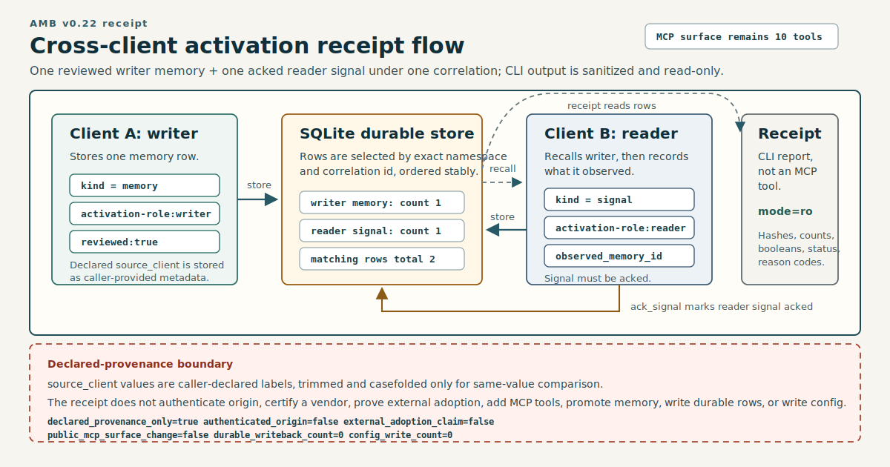
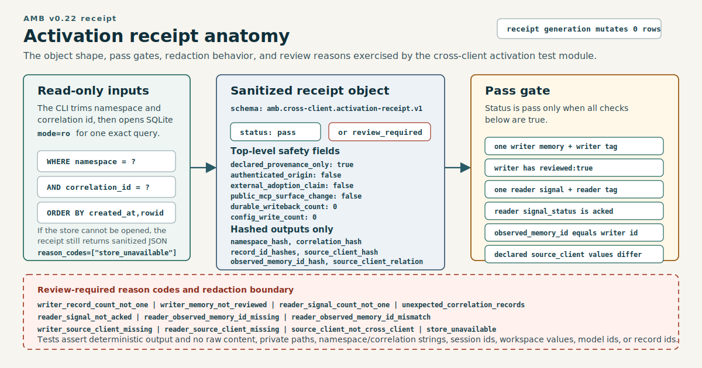

# v0.22.1 - Visual Launch Polish

Agent Memory Bridge 0.22.1 is a release-facing docs and visual polish release
for the v0.22 Cross-Client Activation Receipt. Runtime behavior is unchanged
from 0.22.0.

`0.22.1 = the same local receipt behavior, explained with committed visual assets and a machine-readable inventory.`

## What Changed

- The README first screen now uses
  `examples/diagrams/v0.22-shared-memory-hero.png` as a conceptual hero image.
- `examples/diagrams/amb-overview.svg` moved into a concise README "How It
  Works" section.
- `docs/RELEASE-COMMUNICATIONS.md` now documents the conditional visual-release
  contract and the machine visual inventory.
- `docs/v0.22.0-announcement.md` is restored to its historical text-only state.

## Visual Assets

Figure 1. Conceptual visual only: a shared-memory workspace metaphor for AMB.
It is not product evidence, identity evidence, certification, distribution, or
use proof.

Figure 2. `v0.22-cross-client-activation.svg` shows the existing local receipt
flow: one reviewed writer memory, one acked reader signal, one namespace, one
correlation id, and a sanitized read-only receipt.

Figure 3. `v0.22-receipt-anatomy.svg` shows the receipt object shape. Raw
content, private paths, sessions, workspaces, model ids, namespace and
correlation values, record ids, and source-client labels are omitted or hashed.

## Visual Contract

Visuals are conditional release material. A release story can depend on a visual
only when the asset is committed, the path is stable, the alt text is
descriptive, and the caption stays tied to checked evidence. If a planned visual
is missing at cutoff, the embed should be removed or the release story should
stop.

The visual gate also requires raster renders at native size and README-width.
The release story should stop if either render shows clipping, overlap, or
crossed labels.

## Machine Inventory

The machine inventory is `examples/diagrams/visual-claims.json`. It records each
visual asset path, asset type, narrow illustrated claim, evidence paths, and
release applicability. For the hero PNG, it also records that the image is
conceptual and that semantic validation was not performed.

The release contract treats this inventory as hygiene. It can check asset
existence, SVG XML with nonempty `title` and `desc`, PNG signature and
dimensions, evidence path existence, explicit release applicability status, and
absence of obvious private machine paths. It does not prove that a visual claim
is true.

## Validation

- `pytest`: `395 passed`
- public MCP surface: unchanged at `10` tools
- receipt durable writeback from generation: `0`
- receipt client config writes from generation: `0`

## Boundaries

0.22.1 does not add MCP tools, change the receipt runtime, write client
configuration, promote memory, or perform automatic durable writeback. The
visuals explain current receipt behavior; they do not prove identity,
certification, distribution, or use outside local configured clients.
