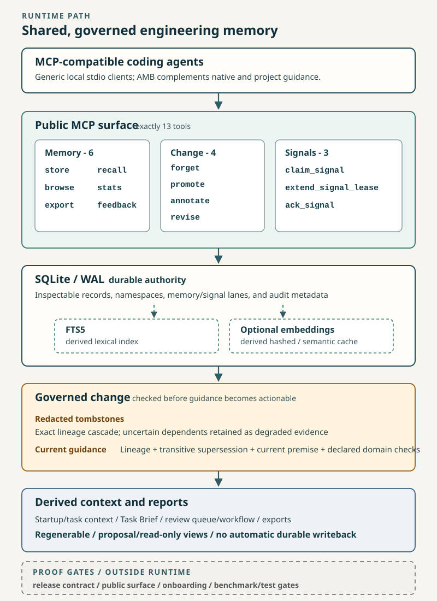
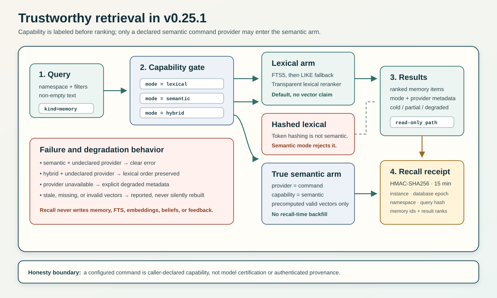
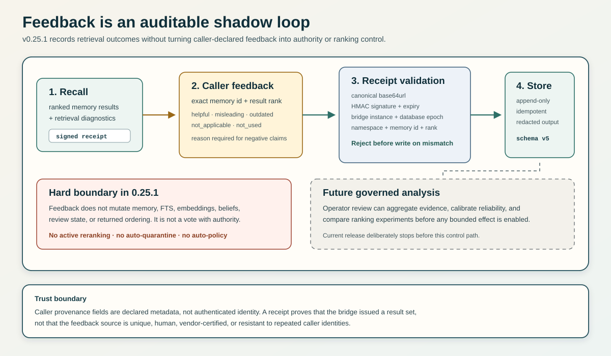

# v0.25.1 - Cross-Platform Receipt Integrity

Agent Memory Bridge 0.25.1 is a narrow correctness patch for Trustworthy
Adaptive Retrieval. It does not change the 13-tool MCP surface or schema v5.

## System view

  

The overview separates durable authority from derived retrieval indexes and
shows the key v0.25 boundary: feedback becomes auditable evidence without
becoming an automatic ranking or policy control path.

## Trustworthy retrieval

  

The default hash provider is labeled `hashed_lexical`, not semantic. Explicit
semantic mode requires a command provider that declares semantic capability;
hybrid mode skips the semantic arm and preserves lexical ordering when that
capability is absent. Recall uses precomputed valid vectors only and performs no
index or memory writes.

## Feedback shadow loop

  

A caller can submit an outcome only for an exact memory id and rank contained in
a valid short-lived receipt. AMB validates canonical encoding, signature,
expiry, bridge instance, database epoch, namespace, memory id, and rank before
writing append-only feedback. The record remains shadow-only and does not alter
memory, FTS, embeddings, beliefs, review state, or returned ordering.

## What changed

- Recall receipt decoding now rejects non-canonical base64url aliases, including
  encodings that decode to the same signature bytes.
- Receipt tamper tests now mutate signature bytes deterministically and cover
  non-canonical payload and signature forms.
- The command-provider test gateway consumes stdin before early output or exit,
  removing a Windows Python 3.11 pipe race that could mask the intended provider
  error.
- Test command construction now uses the same POSIX-style argv quoting expected
  by the production command parser.

## Validation snapshot

- `pytest --collect-only -q tests`: `604 tests collected`
- Full isolated suite: `601 pass`, `3 skip`
- Focused receipt tests: `23 pass`
- Repeated Windows Python 3.11 command-provider regression: `25 pass`
- Release contract, public-surface, onboarding, lint, format, and typing gates
  pass locally.

## Boundaries

This patch does not add active feedback reranking, authenticated callers,
namespace ACLs, ANN retrieval, graph memory, automatic policy, hosted identity,
or multi-user infrastructure. Feedback remains append-only, receipt-bound,
redacted, and shadow-only.
